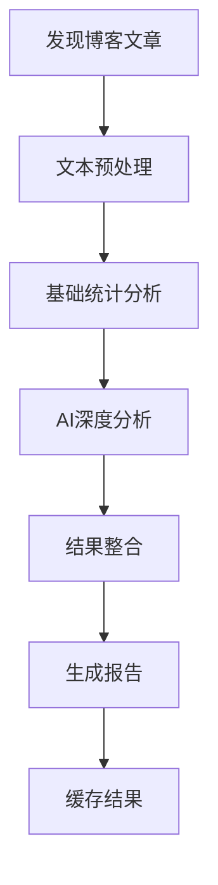
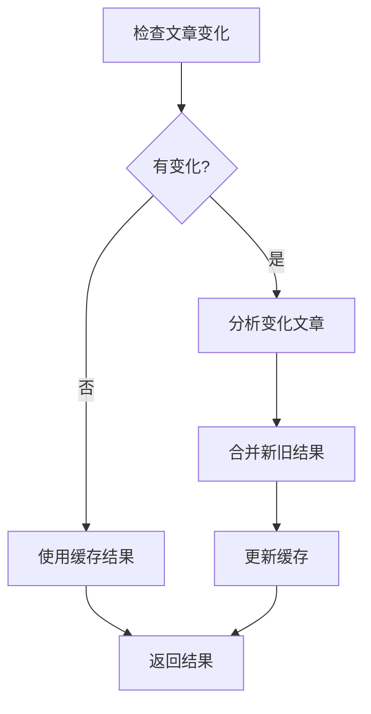

# 博客分析工具集

本目录包含了完整的博客分析解决方案，包括文本分析、AI深度解读和结果展示。

## 📁 项目结构

```
scripts/
├── blog_analysis.py                    # 主分析脚本
├── analyzers/                          # 分析器模块
│   ├── __init__.py                     # 模块初始化
│   ├── basic_analyzer.py               # 基础统计分析器
│   ├── ai_analyzer.py                  # AI深度分析器
│   └── result_integrator.py            # 结果整合器
├── utils/                              # 工具模块
│   ├── __init__.py                     # 模块初始化
│   ├── text_processor.py               # 文本预处理工具
│   └── cache_manager.py                # 缓存管理器
├── output/                             # 输出目录
│   ├── cache/                          # 缓存目录
│   └── *.json                          # 分析结果文件
├── requirements.txt                     # Python依赖包
├── integrate_analysis_to_about.py      # About页面集成脚本
├── README.md                           # 本说明文档
└── README_integration.md               # 集成说明文档
```

## 🚀 快速开始

### 1. 环境准备

确保已安装Python 3.8+和必要的依赖包：

```bash
cd scripts
pip install -r requirements.txt
```

### 2. 设置环境变量

设置火山引擎API密钥：

```bash
export DOUBAO_API_KEY=your_api_key_here
```

### 3. 运行分析

```bash
python blog_analysis.py
```

### 4. 集成到About页面

```bash
python integrate_analysis_to_about.py output/blog_analysis_最新时间.json
```

## 🔧 核心脚本说明

### `blog_analysis.py` - 主分析脚本

**功能**：
- 自动发现和读取所有博客文章
- 执行基础文本统计分析
- 调用AI进行深度分析
- 生成结构化分析报告
- 支持增量更新和缓存

**命令行参数**：
```bash
# 正常分析（支持增量更新）
python blog_analysis.py

# 强制重新分析
python blog_analysis.py --force

# 查看缓存信息
python blog_analysis.py --cache-info

# 清除缓存
python blog_analysis.py --clear-cache

# 指定输出路径
python blog_analysis.py --output custom_path.json

# 指定博客目录
python blog_analysis.py --blog-dir custom_blog_path
```

**输出文件**：
- `scripts/output/blog_analysis_YYYYMMDD_HHMMSS.json` - 分析结果
- `scripts/output/cache/` - 缓存文件

### `integrate_analysis_to_about.py` - 页面集成脚本

**功能**：
- 自动读取分析结果JSON文件
- 将结果集成到About页面
- 自动更新页面结构和导入
- 创建备份文件

**使用方法**：
```bash
python integrate_analysis_to_about.py output/blog_analysis_20250818_110906.json
```

## 📊 分析维度

### 1. 基础统计分析
- **词汇分析**：词频统计、词汇多样性、平均词长
- **句子分析**：句长分布、复杂度分析、句子类型
- **段落分析**：段落长度、结构特征
- **情感分析**：积极/消极/中性词汇统计
- **主题分析**：关键词提取、主题分类

### 2. AI深度分析
- **写作风格**：语言特色、结构特征、表达风格
- **性格特征**：Big Five人格模型评分
- **思维模式**：思维类型、问题解决方式、学习风格
- **内容偏好**：主题选择、内容深度、表达方式
- **情感表达**：情感基调、深度、变化模式

### 3. 综合评分
- **写作能力**：词汇、句子、情感、结构的综合评分
- **内容质量**：主题多样性、深度、实用性评分
- **个性平衡**：Big Five各维度的平衡性评分
- **总体评分**：综合能力评估

## 🎯 使用场景

### 个人博客分析
- 了解自己的写作风格特点
- 发现写作中的优势和不足
- 跟踪写作能力的成长轨迹

### 内容优化
- 识别内容主题分布
- 分析读者情感反应
- 优化写作策略

### 个人品牌展示
- 在About页面展示AI分析结果
- 增加页面的科技感和互动性
- 展示个人特色和专业性

## 🔄 工作流程

### 完整分析流程


### 增量更新流程


## 📈 性能优化

### 缓存机制
- **分析结果缓存**：7天有效期，避免重复分析
- **文章哈希缓存**：检测内容变化，支持增量更新
- **智能缓存管理**：自动过期清理和更新

### 增量分析
- 只分析发生变化的文章
- 复用已有的AI分析结果
- 大幅减少API调用成本

### 批量处理
- 批量读取和处理文章
- 优化内存使用
- 提高处理效率

## 🛠️ 故障排除

### 常见问题

1. **API密钥错误**
   ```bash
   # 检查环境变量
   echo $DOUBAO_API_KEY
   
   # 重新设置
   export DOUBAO_API_KEY=your_key_here
   ```

2. **依赖包缺失**
   ```bash
   # 重新安装依赖
   pip install -r requirements.txt
   ```

3. **文件路径错误**
   ```bash
   # 检查文件是否存在
   ls -la src/content/blog/
   
   # 使用绝对路径
   python blog_analysis.py --blog-dir /absolute/path/to/blog
   ```

4. **缓存问题**
   ```bash
   # 清除缓存
   python blog_analysis.py --clear-cache
   
   # 强制重新分析
   python blog_analysis.py --force
   ```

### 调试模式

启用详细日志输出：

```bash
# 设置日志级别
export PYTHONPATH=.
python -u blog_analysis.py 2>&1 | tee analysis.log
```

## 📝 自定义配置

### 修改分析参数

编辑 `analyzers/basic_analyzer.py`：

```python
# 调整情感词汇词典
self.emotion_words = {
    'positive': ['你的积极词汇'],
    'negative': ['你的消极词汇'],
    'neutral': ['你的中性词汇']
}

# 调整主题分类
self.tech_words = ['你的技术词汇']
self.life_words = ['你的生活词汇']
```

### 修改AI分析提示词

编辑 `analyzers/ai_analyzer.py`：

```python
# 自定义系统提示词
system_prompt = """你的自定义提示词"""
```

### 调整输出格式

编辑 `analyzers/result_integrator.py`：

```python
# 修改评分计算逻辑
def _calculate_style_scores(self, analysis_results):
    # 你的自定义评分算法
    pass
```

## 🔒 安全考虑

### API密钥管理
- 不要在代码中硬编码API密钥
- 使用环境变量或配置文件
- 定期轮换API密钥

### 数据隐私
- 分析结果可能包含敏感信息
- 谨慎分享分析报告
- 考虑数据匿名化处理

### 缓存安全
- 缓存文件包含原始内容哈希
- 定期清理缓存文件
- 避免将缓存文件提交到版本控制

## 📚 技术架构

### 模块设计
- **分层架构**：基础统计、AI分析、结果整合
- **模块化设计**：每个功能独立，易于维护和扩展
- **接口标准化**：统一的输入输出格式

### 数据流
```
原始文本 → 预处理 → 基础分析 → AI分析 → 结果整合 → 输出报告
```

### 扩展性
- 支持添加新的分析维度
- 支持更换AI模型
- 支持自定义输出格式

## 🤝 贡献指南

### 开发环境
1. Fork项目仓库
2. 创建功能分支
3. 编写测试用例
4. 提交Pull Request

### 代码规范
- 遵循PEP 8 Python代码规范
- 添加详细的文档字符串
- 编写单元测试
- 保持代码简洁和可读性

### 功能建议
- 提交Issue描述新功能需求
- 提供使用场景和示例
- 讨论技术实现方案

## 📄 许可证

本项目采用MIT许可证，详见LICENSE文件。

## 📞 支持与反馈

- **问题反馈**：提交GitHub Issue
- **功能建议**：参与项目讨论
- **技术交流**：加入开发者社区

---

**注意**：本工具集需要火山引擎豆包API支持，请确保有有效的API密钥和足够的调用额度。
