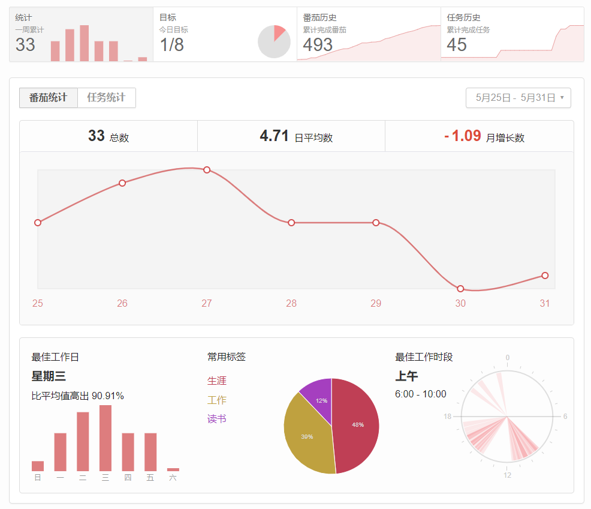

### 统计

\# 生涯

看李宏毅课程学习 BERT 的原理，并且发了 [CSDN 的文章](https://blog.csdn.net/m0_37991005/article/details/106336964)。此外看论文和调试开源的项目代码，学完数据导入部分。清理了一些印象笔记收藏的文章，收藏不看系列该终结了……

还有一个很重要的，就是开始思考未来找工作的事情，突然发现自己学的好像跟找工作关系不大？还是要面向工作学习，但是这个一时半会也想不到做什么项目会更好，需要长期地思考。

\# 工作 

这周课程比较多，花费的时间也比较多，包括做公共演讲 PPT，然后又推倒修改。这样效率真的挺低的，还是没有有效沟通的原因，但是大家可能都想着水一水过去。**想要自己效率高又成绩好的话，还是要有点领导能力，不能干等，多数人还是拖延且混的。**

\# 读书

这周读书 4 个番茄，读完了《学会提问》，正在做笔记。读到后面觉得没有什么感觉也没记住什么。工具类的书籍，好像也不用读的那么细致入微，需要的时候再看吧。

今天突然想看一下《断舍离》了，找一找“道”的感觉。

### 随想

这周开始践行 GTD 的法则，然后每天都总结和复盘，确实觉得对于生活的掌控好了许多，没有那么多的焦虑感了。不过琐事还是挺多的，比较烦人😠

对于另一半的小想法

> 对我来说，多好看的女生看多了都会觉得没有那么惊艳动人，所以再找女朋友最重要的是性格是不是跟我聊得来，对于颜值的期待要放的低一点。否则，始于颜值，也会终于颜值。

其他

> 可能生活中大多数事情长远来看都是没有什么意义的，所以还是要优先去做有意义的事情。人生短暂，别浪费在很多没什么用的事情上。

> 今天有点钻牛角尖了，如果不是时间紧迫，一件事情没有完成就先记录下来然后做其他的，而不是一直做。还有就是先把轮廓搞出来再做调整，不然 ppt 重新做又没什么用了。

> 爱一个人，不是用你认为应该的方法，而是考虑对方的想法。生活不只有对错，重要的是内心的温暖。（看1988善宇对妈妈说你可以去干活）

看毕导的科学脱单视频，下面的话很有感触

> 37%法则的关键就是时间和爱情的单向性，曾经在一起的人，哪怕再好也不能回头了。眼下一旦做出的决定，即使未来还有更好的也不再为之所动。没有什么策略能保证你找到那个绝对的最优解，但眼前这个人已然是你最好的选择了。

但是又觉得没什么好再写的，写出来都感觉像是矫情，就酱吧。

这周还看了《岁月神偷》，但是没什么共鸣，一看豆瓣 8.7 的评分有些震惊。

