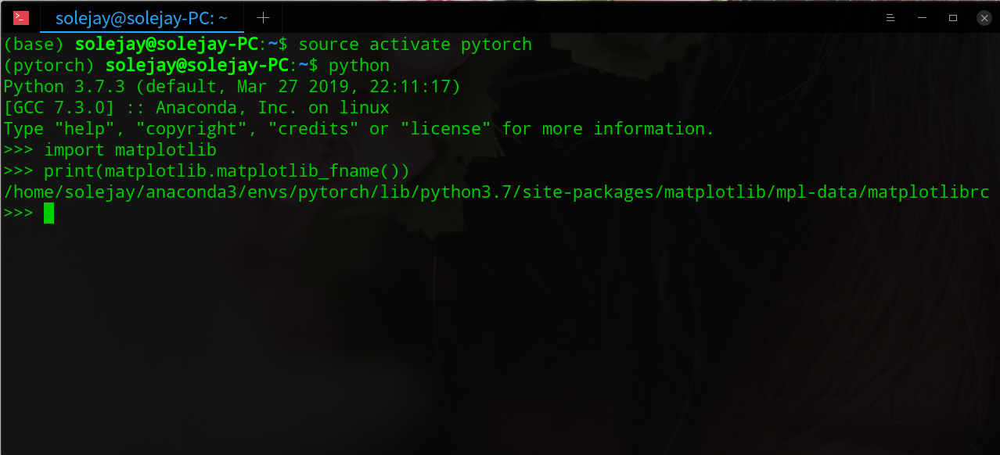
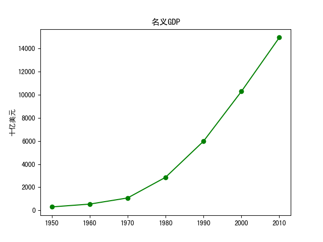

<!--more-->

matplotlib 库设置中文显示时会出现小方框，为了解决这个问题查阅了很多资料，但是都是直接在系统环境中修改，而我用的是 Anaconda 自建的环境，无法解决问题，因此查了很久之后找到了解决方法。

1. **下载字体**

下载中文字体 [SimHei.ttf](http://www.xiazaiziti.com/210356.html)

2. **删除当前用户 matplotlib 的缓冲文件**

```
$cd ~/.cache/matplotlib
$rm -rf *.*
```

3. **添加字体**

- 首先在终端中进入你的环境
- 查看 matplotlib 配置文件位置

```python
import matplotlib
print(matplotlib.matplotlib_fname())
```



- 进入对应文件夹


- 将下载的字体放到 `fonts/ttf` 文件夹

4. **编辑配置文件 `matplotlibrc`**

`    #font.sans-serif:DejaVu Sans, Bitstream Vera Sans, Lucida Grande, Verdana, Geneva, Lucid, Arial, Helvetica, Avant Garde, sans-serif`

修改为

`    font.sans-serif: SimHei, DejaVu Sans, Bitstream Vera Sans, Lucida Grande, Verdana, Geneva, Lucid,  Arial, Helvetica, Avant Garde, sans-serif`

修改的地方就是去掉了 `#` ，添加了下载的字体 `SimHei`

5. 重启 Anaconda
6. 测试一下是否成功

```python
#!/usr/bin/env python
#coding:utf-8
import matplotlib as  mpl
from matplotlib  import pyplot as plt
years = [1950, 1960, 1970, 1980, 1990, 2000, 2010]
gdp = [300.2, 543.3, 1075.9, 2862.5, 5979.6, 10289.7, 14958.3]
#创建一副线图,x轴是年份,y轴是gdp
plt.plot(years, gdp, color='green', marker='o', linestyle='solid')
#添加一个标题
plt.title(u'名义GDP')
#给y轴加标记
plt.ylabel(u'十亿美元')
plt.show()
```



参考文章：

[mac Anaconda matplotlib 中文乱码问题](https://blog.csdn.net/jsjxiaobing/article/details/78973142)

[ubuntu系统下matplotlib中文乱码问题](https://blog.csdn.net/jeff_liu_sky_/article/details/54023745)

[解决matplotlib中文乱码问题（Ubuntu16.04）](https://blog.csdn.net/github_33934628/article/details/77874674)
