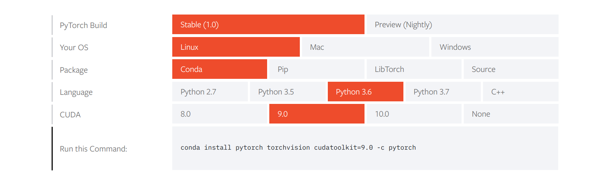
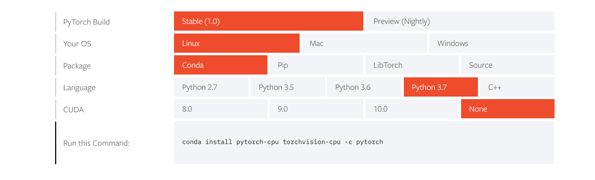
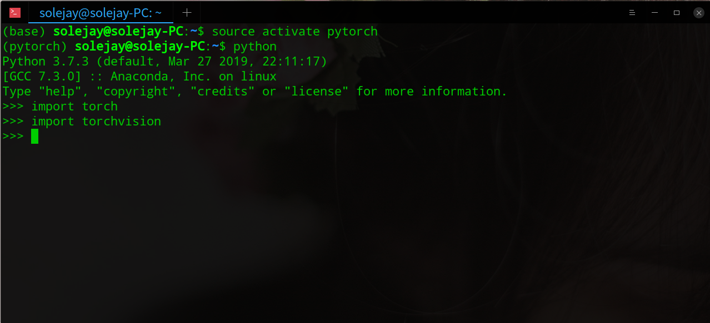

<!--more-->

因为在刚开始安装 PyTorch 的时候不懂，第一次安装了 cuda 版本的，但是我是 A 卡， cuda 是英伟达的技术，所以我只能装 cpu 版本的 PyTorch，其中也遇到了许多坑，希望可以帮助后面遇到的人。

我比较推荐用 Anaconda 安装，可以管理环境不会对系统的环境有影响，安装方法网上搜一下就好了。

首先进入 PyTorch 的官网，点击`Get Started`



默认的是这样的，是安装 cuda 版本的，而我的需要安装 CPU 版本，并且我的 Python 版本是 3.7，所以选择适合自己的版本就好了。



在这里有第一个坑，按照它给出的代码输入下载速度太慢了，我在网上找了好久找到了解决的办法，那就是把最后的语句去掉。也就是`conda install pytorch-cpu torchvision-cpu -c pytorch` 改成`conda install pytorch-cpu torchvision-cp`。大神的解释是去了`-c pyotrch` 之后，conda 就可以从你添加的第三方源下载，速度就会特别快了。

接着，第二个坑又来了。我以前添加了清华的镜像源，但是下载还是很慢，后来看到清华刚刚关停了这个源。


因此我又开始找其他的第三方源，找到了中科大和腾讯的 conda 源

因此在`~/.condarc` 编辑成这样就可以了

```
channels:
  - https://mirrors.cloud.tencent.com/anaconda/cloud//pytorch/
  - https://mirrors.cloud.tencent.com/anaconda/pkgs/main/
  - https://mirrors.cloud.tencent.com/anaconda/pkgs/free/
  - https://mirrors.ustc.edu.cn/anaconda/pkgs/free/
  - defaults
show_channel_urls: true
```

之后就可以愉快地安装 PyTorch 了

最后验证一下是否安装成功

