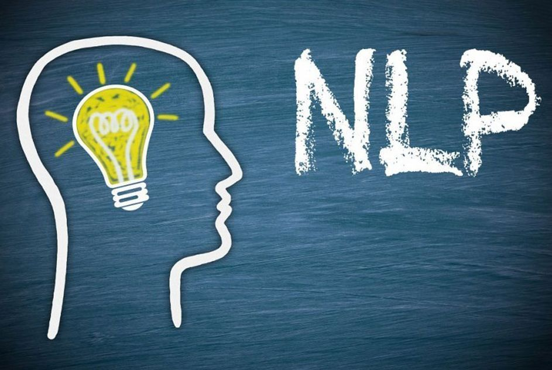
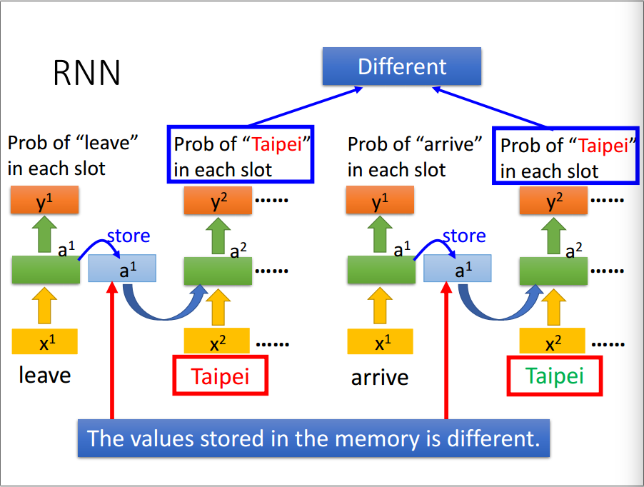
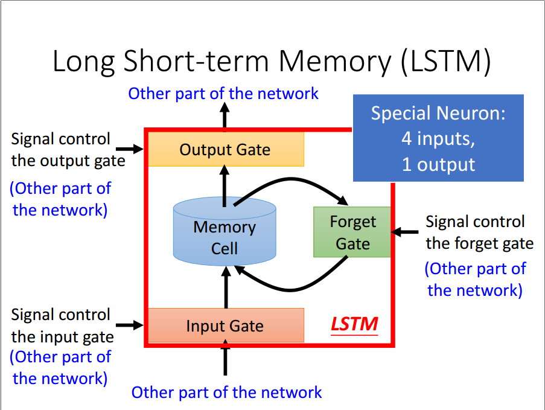
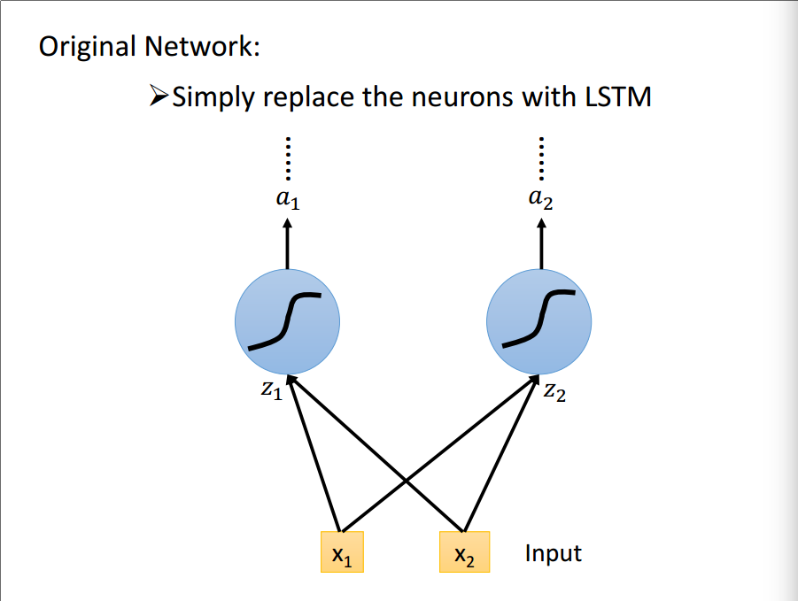
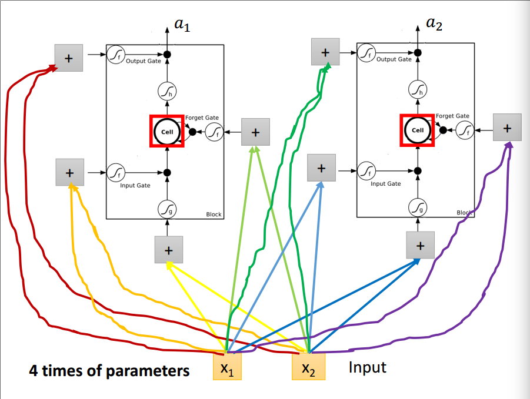
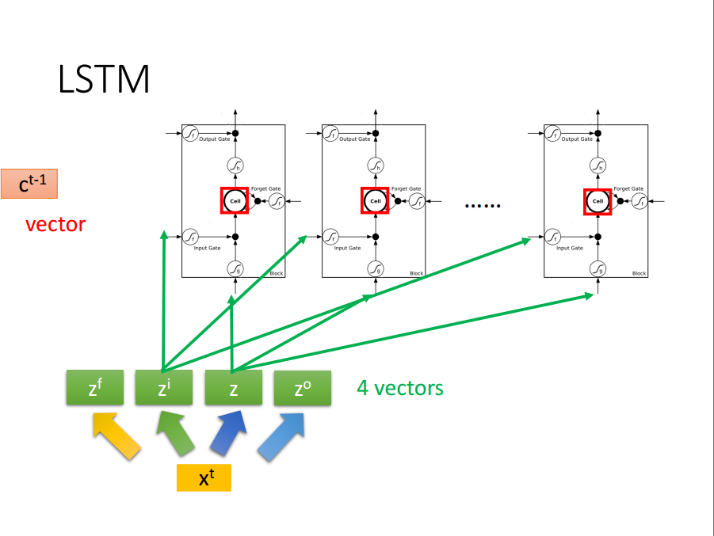
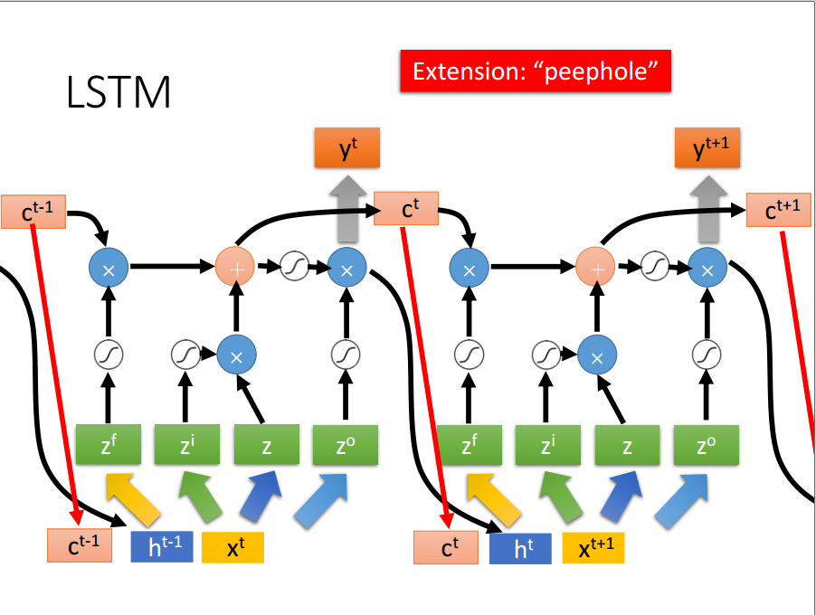
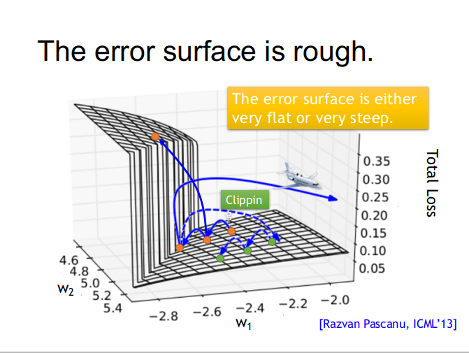
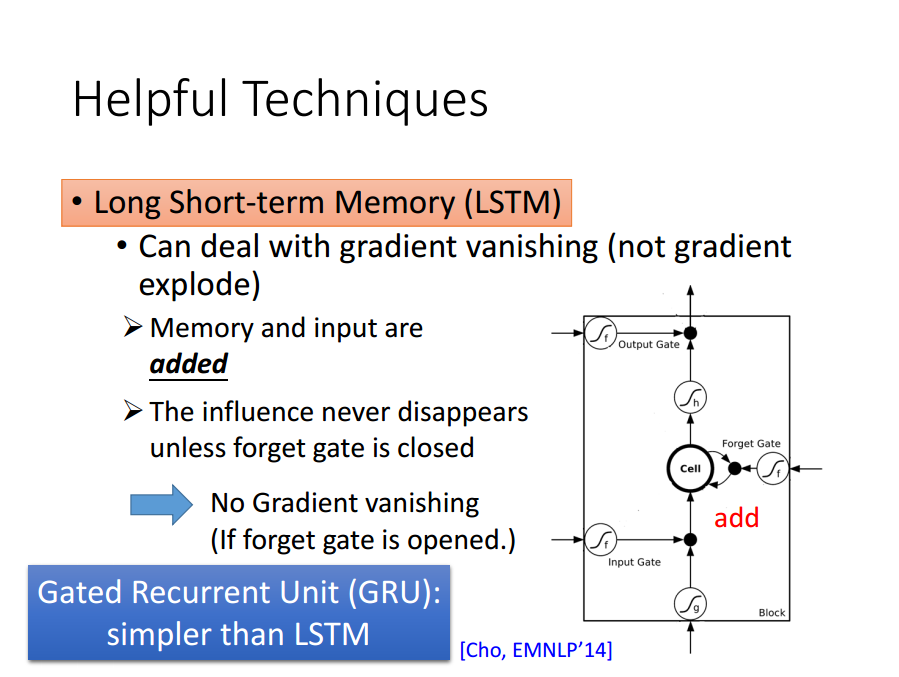

<!--more-->

# RNN

对于 Slot Filling 问题，需要识别出句子中的某些特定词，比如我要在十一月二号到台北去，识别出目的地是台北，时间是十一月二号。对词进行编码的方法可以采用 1-of-N encoding 和 word hashing 或者其他高级方法，词语表征成向量后丢到神经网络里判断词属于每个 slot 的概率，比如台北属于目的地的概率和属于时间的概率。

但是这种方法有很严重的问题，“我要在十一月二号到台北去”和“我要在十一月二号从台北走”用上述方法判断的目的地都是台北。因此需要 Neural Netowork 有“记忆”，引入 RNN（Recurrent Neural Network）。

隐藏层的输出会保存到记忆单元里供后面使用。RNN 在考虑 input 的 sequence 的时候，并非是 independent

也就是 RNN 会考虑 input sequence 的 order，所以任意调换 input 的顺序，他的 output 结果是不一样的。

考虑多个隐藏层的结构，深度网络。如果是将隐藏层的输出存储在记忆中称为 Elman Network，将输出层的输出值存储在记忆中就称为 Jordan Network。

双向(Bidirectional)RNN从顺逆两个方向上考虑。双向的好处是，我们在产生 output 时，我们不止有看了从句首到句尾这个方向，同时也看了句尾到句首的方向，这样双向的理解比较全面。

# LSTM

长短时记忆网络(Long Short-term Memory,LSTM)指的是具有多个长的短时间记忆网络。

其网络形状有四个输入，一个输出。

- 单纯把原本的 NN 换成 LSTM 就完成了和 Neural Network 的整合

换成 LSTM 后，因为有 4 个 input 所以比起一般的 NN，参数数量多四倍

- 对于简版的 LSTM，可以看成 xt 经过 transform 得到 zf , zi, z , zo 四个 vector 分别去控制 LSTM 四个参数，ct-1 代表 memory cell 裡面上一个时间点 t-1 的值

- 真正的 LSTM 还会把 hidden layer 的输出 h 接上，还会加上所谓的 “peephole” 就是把上一个时间点 memory cell 的值 ct-1 也接过来，再在经过不同的 transform 得到四个不同的 z vector 去控制 LSTM，LSTM 也不止一层，可以叠个五六层

Keras 有支援 LSTM，所以虽然架构超级複杂，但实作起来还算容易
GRU：简化版本的 LSTM 只有两个 Gate 参数比较少，比较不容易 overfitting

# RNN 的训练

在学习训练RNN时可以用梯度下降(gradient descent)方法。

然而基于RNN的网络是不好训练的。损失曲面要不是平的要不就是陡峭的，不易训练。

RNN 的 “Error surface”  也就是Total Loss 对于参数的变化，有些地方非常平坦，但有些地方则是非常陡峭，造成可能在更新参数时，恰好跳过悬崖，发生 loss 剧烈暴增，剧烈震荡的情况

在很平坦的区域 learning rate 渐渐调的比较大，如果不幸刚好不小心一脚踩在悬崖峭壁上，很大的 gradient 乘上很大的 learning rate 参数就会 update 很多，参数就飞出去了

解决方法：Clipping 当 gradient 大于某一个 threshold 时，就把它限制在那个 threshold 所以现在 gradient 不会过大，参数只会飞到比较近的地方，限制住参数更新大小不飞出去

**解决技巧：LSTM**

问：为什么我们把 RNN 换成 LSTM ?

答：因为 LSTM 可以处理 Gradient Vanishing 的问题

问：Why LSTM can handle gradient vanishing ? 

答：RNN 跟 LSTM 在面对 memory 的处理上相当不同
在普通的 RNN 架构中，每一个时间点 Memory 里面的值都会被洗掉覆盖掉，所以影响就消失了，
但是 LSTM 的做法是把原本 Memoy 里面的值乘上一个值，再跟 input 是相加的，所以一但有一个值被存进 Memory 造成影响，这的影响就会被永远的留着，除非 forget gate 把 memory 洗掉，否则影响会永远留着，所以不会有 gradient vanishing 的问题。

→ Forget Gate 在多数的情况下，要保持开启（不忘记）只有少数情况下， forget gate 关闭，把 memory 里面的值洗掉

Gate Recurrent Unit (GRU) 只有两个 Gate，需要的参数量比较少，所以在 training 时比较好训练，他会把 input gate 跟 forget gate 连动，也就是要把存在 memory 里面的值清掉，才能把新的值存进来 “旧的不去，新的不来”！

其他技巧：使用一般的 RNN (不用 LSTM)且使用 Identity matrix 来 initailize transition weight matrix 时，再搭配 ReLU 的 activation function ，会有比较好的 performance

# RNN 应用

- slot filling
- 语义分析（input 一个 character sequence，output 对于整句的理解分类，例如好雷负雷）
- 关键词提取（给 machine 一篇文章，然后自动找出这篇文章中有哪些关键词）
- 语音识别（CTC、语音翻译）
- document to sequence（sequence-to-sequence auto-encoder 方法）
- 阅读理解
- 视觉问题回答
- 语音回答（托福测试）

**参考链接**

[[ML筆記] Recurrent Neural Network (RNN) - Part I](http://violin-tao.blogspot.com/2017/12/ml-recurrent-neural-network-rnn-part-i.html)

[李宏毅机器学习2016 第二十二讲 循环神经网络RNN](https://zhuanlan.zhihu.com/p/33149238)

