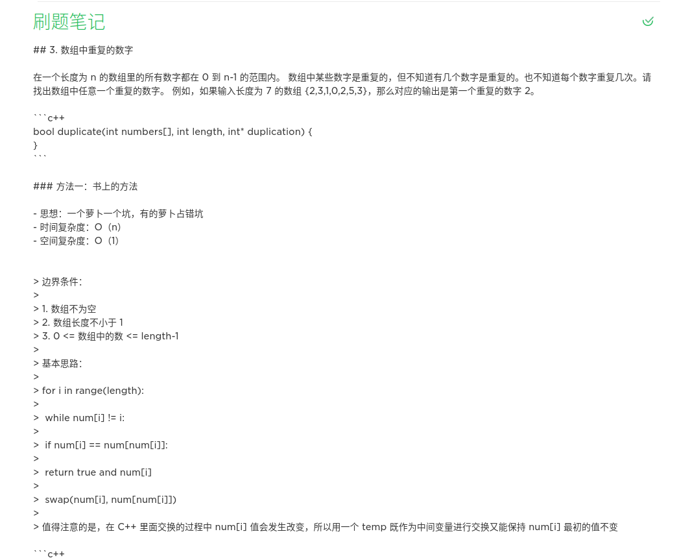
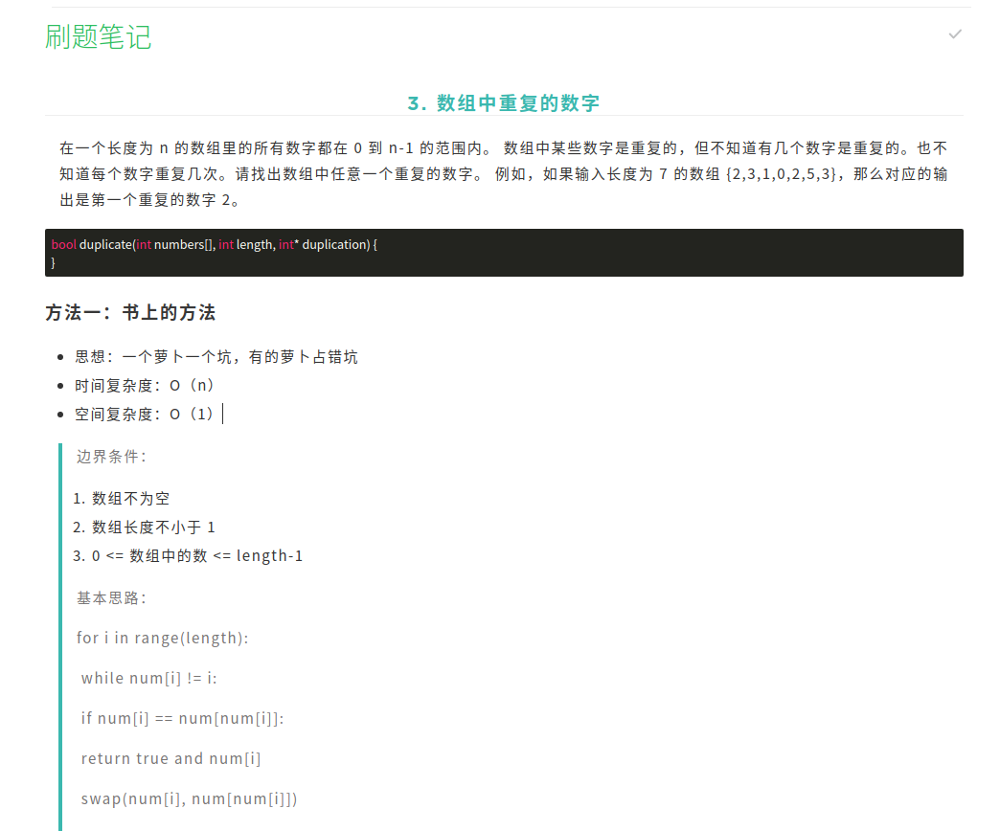

### 1. 下载 Markdown Here 浏览器插件

[官网地址](https://markdown-here.com/)

将插件安装到对应的浏览器内

### 2. 自定义 Markdown 显示样式

可以在[这个仓库](https://github.com/nivance/markdown-here-css)中找自己喜欢的显示样式，设置方式如下：

1. 在扩展中右键 Markdown Here 扩展，选择`选项`
2. 在基本渲染 CSS 中粘贴在仓库中复制的 CSS 文件的代码，即可实时预览显示方式

**代码高亮设置**

访问 [highlight.js](https://highlightjs.org/) 下载压缩包，选择喜欢的 CSS 文件将代码粘贴到 Markdown Here 扩展选项卡语法高亮 CSS 内

### 3. 编辑 Markdown 并粘贴到印象笔记中

### 4. 选中所有文字点击 Markdown Here 扩展

Note：选中文字后再次点击扩展就会回到 markdown 的格式

