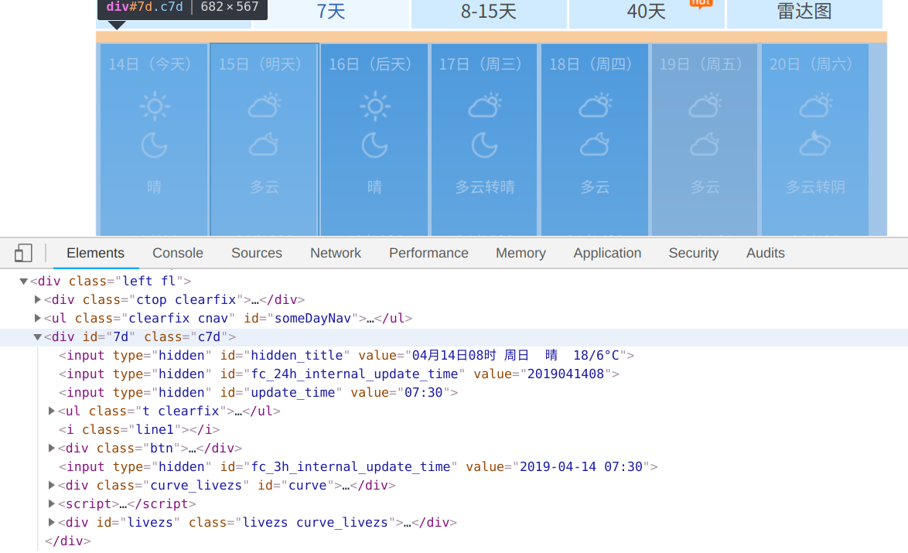
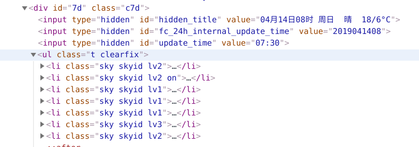
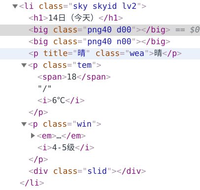
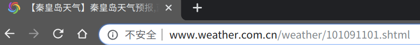
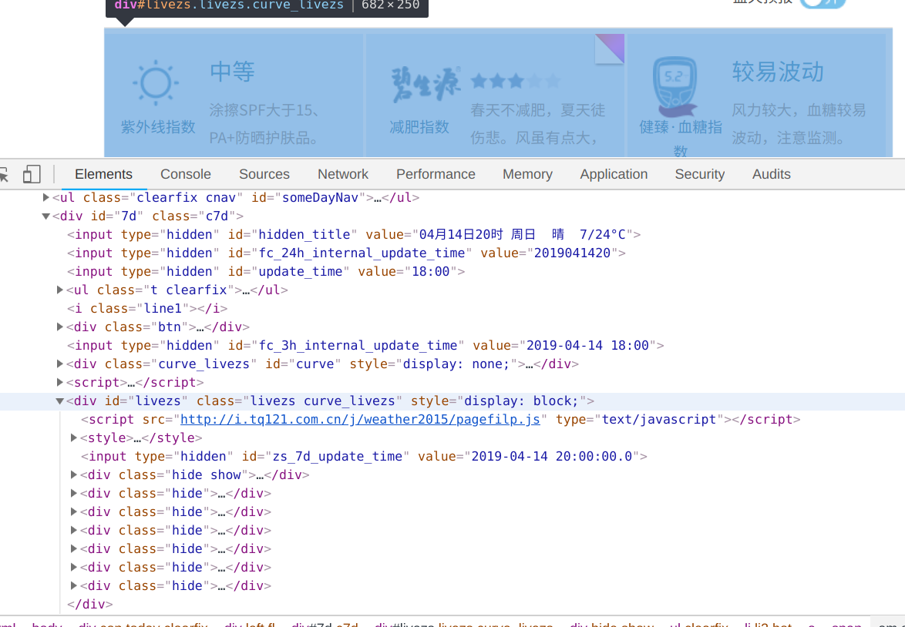
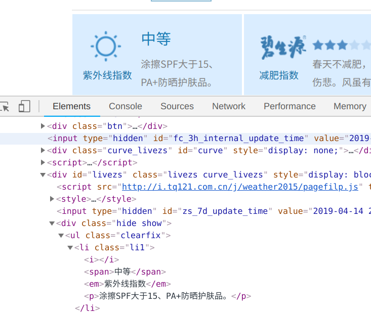
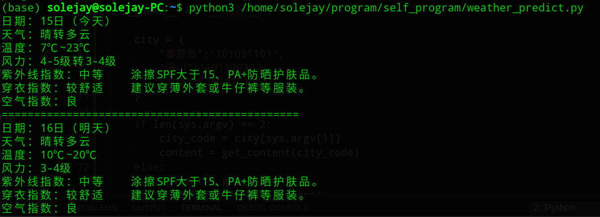

通过爬取中国天气网上的数据，解析天气情况和生活建议，在终端显示未来几天的天气和建议。


<!--more-->

因为自己平时都不看手机上的天气 app，因此都是出门之后“冷暖自知”，而在秦皇岛晚上总是会被冻得瑟瑟发抖，因此想写一个小脚本可以查询未来几天的天气，让自己选择合适的衣服。

经过查询，选择[中国天气网](http://www.weather.com.cn/weather/101091101.shtml) ，里面有七天的预报。

- 静态网页



通过 F12 调用开发者工具，找到未来七天天气预报的位置



向下打开，看到 ul 标签下有七个 li 标签，应该是对应七天的天气



不出所料，正是每天的天气情况。下面就开始写代码

```python
import sys
import requests
from lxml import html
```

导入 requests 库和 html 库，sys 库用来接收要查询的城市名



观察上面的 url，查询不同的城市对应的后面的数字是不一样的，因此查询不同的城市只要修改对应的数字串就可以了

```python
def get_content(code='101091101'):
    url = 'http://www.weather.com.cn/weather/%s.shtml' % code
    return requests.get(url).content
```

获取申请访问的内容

```python
# 获取温度
def get_tem(top, index):
    tem_low = top.xpath('li[%d]/p[@class="tem"]/i/text()' % index)[0]
    if len(top.xpath('li[%d]/p[@class="tem"]/span' % index)) != 0:
        tem_high = top.xpath('li[%d]/p[@class="tem"]/span/text()' % index)[0] + '℃'
        return tem_low + ' ~' + tem_high
    else:
        return tem_low
```

后来我发现到了晚上就没有最高温度和最低温度了，只有当前温度，因此写个函数处理一下温度的获取。当有两个温度的时候，输出最低温度到最高温度，只有当前温度时输出当前温度。



生活指数的结构在这里



然后就开始编写代码获取生活建议

```python
# 生活指数
def shzs():
    l = []
    for i in sel.xpath('//ul[@class="clearfix"]'):
        # 防晒指数
        span_intension = i.xpath('li[1]/span/text()')[0]
        span_product = i.xpath('li[1]/p/text()')[0]
        if len(span_intension) == 1:
            span = '紫外线指数：' + span_intension + '      '+ span_product
        else:
            span = '紫外线指数：' + span_intension + '    '+ span_product
        # 穿衣指数 
        dress_intension = i.xpath('li[4]/a/span/text()')[0]
        dress_sug = i.xpath('li[4]/a/p/text()')[0]
        if len(dress_intension) == 2:
            dress = '穿衣指数：' + dress_intension + '      ' + dress_sug
        else:
            dress = '穿衣指数：' + dress_intension + '    ' + dress_sug
        # 空气指数
        air_condition = i.xpath('li[6]/span/text()')[0]
        air = '空气指数：' + air_condition
        t = (span, dress, air)
        l.append(t)
    return l
```

用 tuple 存储三个指数，用 list 存储七天的生活指数

```python
# 预测未来几天的天气和生活指数
def predict_days(days):
    for i in range(1, days+1):
        # 日期
        date = top.xpath('li[%d]/h1/text()' % i)[0]
        # 天气
        weather = top.xpath('li[%d]/p[@class="wea"]/text()' % i)[0]
        # 温度
        tem = get_tem(top, i)
        # 风力
        wind = top.xpath('li[%d]/p[@class="win"]/i/text()' % i)[0]
        print("日期：%s\n天气：%s\n温度：%s\n风力：%s" % (date, weather, tem, wind))
        
        life_condition = shzs() 
        for index in range(3):
            print(life_condition[i-1][index])
        print('==============================================')
```

传入预测的天数，输出天气情况和生活指数



```
if __name__ == "__main__":

    city = {
        "秦皇岛":'101091101',
        "淄川":'101120302',
        "北京":'101010100'
    }

    if len(sys.argv) == 2:
        city_code = city[sys.argv[1]]
        content = get_content(city_code)
    else:
        content = get_content()
    sel = html.fromstring(content)
    top = sel.xpath('//ul[@class="t clearfix"]')[0] # 忘记写 [0] top 类型为list
    suggestions = sel.xpath('//ul[@class="clearfix"]')[0]

    predict_days(7)
```

想要查询别的城市的天气，只需要在 city 里添加对应的城市名和代码即可

`python weather_predict.py 北京` 即可查询北京七天的天气情况

[完整代码](https://github.com/purenjie/python_toy/blob/master/weather_predict.py)