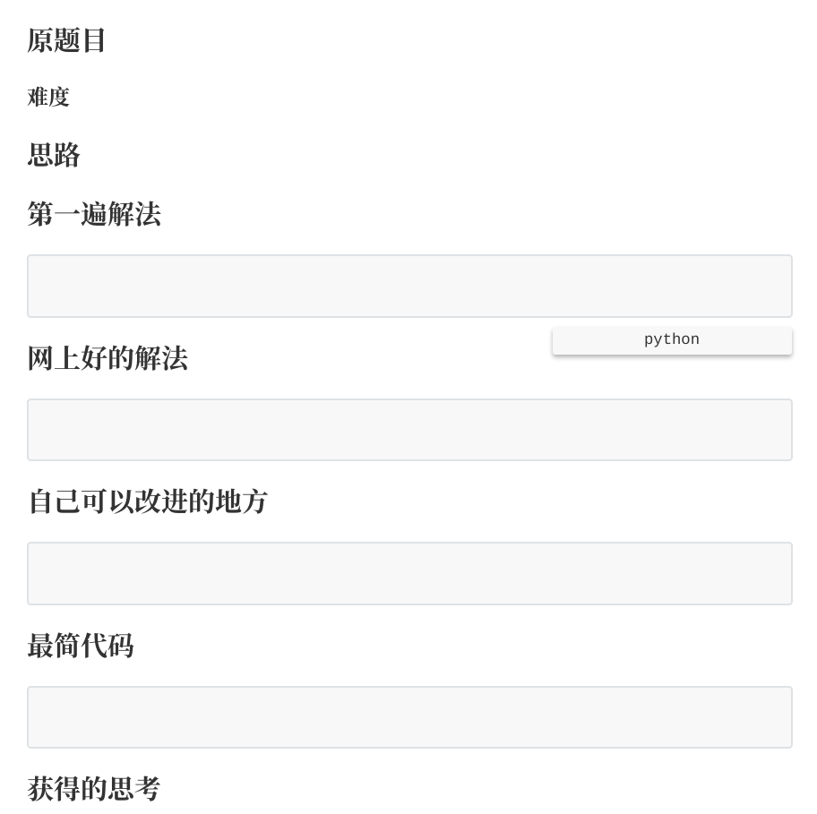

title: 利用 Python 自动生成 leetcode 刷题笔记
tags:
  - python
categories:
  - 编程
date: 2019-04-13 11:56:00
---

通过运行脚本自动生成如下格式 Markdown 文件



<!-- more -->

作为一个冉冉升起的程序员，数据结构和算法是最重要的内功，而自己这方面的能力确实很菜，因此希望可以通过在 LeetCode 上面刷题提升自己的能力。通过看知乎上的优秀回答，学习到了这套刷题笔记的模板。因为不想每次都用手敲，因此写了这个脚本简单快速创立笔记格式。

关于这套流程的原因和益处，在最后的参考阅读中有原答主的回答。

```python
import os
import sys
```

`os` 模块用来对文件夹和文件进行操作，`sys` 模块用来接收命令行传入的笔记的名字

Markdown 格式是我很喜欢的一个格式，简单方便，不用因为排版大费周章，上手快且容易学习，推荐使用。参考阅读中有入门指导，十分钟掌握 Markdown。

每个流程都是 h4 的标题大小，因此写一个函数将标题换位 h4 格式

```python
def h4_title(title):
    for i in range(len(title)):
        title[i] = '#### ' + title[i]
    return title
```

一个换行函数

```python
def br(write_content):
    for i in range(len(write_content)):
        write_content[i] = write_content[i] + '\n'
    return write_content
```

接下来是建立笔记的代码部分

命令行接收输入，通过`sys` 模块读取输入。`sys.argv` 就是从命令行读取的输入，`argv[0]` 是`leetcode_note.py`，`argv[1]` 是 `list_123`。`tag_dir` 是在文件夹下的标签文件夹，每个对应标签都有一个文件夹便于查看和管理；`filename` 就是创建的笔记的名字了。

```python
# e.g. python leetcode_note.py list_123
tag_dir = sys.argv[1].split('_')[0]
filename = sys.argv[1] + '.md'
```

如果`tag_dir` 文件夹不存在，就在原文件夹下创建一个文件夹

进入`tag_dir` 文件夹下

```python
dir_path = '/home/solejay/program/algorithm_leetcode/' + tag_dir
if os.path.exists(dir_path):
    pass
else:
    os.makedirs(dir_path)
os.chdir(dir_path)
```

try catch 判断文件是否已经存在,不存在时生成 md 文件

```python
try:
    os.mknod(filename)
except FileExistsError:
    print('文件已存在！')
else:
    pass
```

下面的代码就是存储每个步骤并且设置好对应的格式

```python
step = ['原题目', '思路', '第一遍解法', '网上好的解法',
        '自己可以改进的地方', '最简代码', '获得的思考']
step = h4_title(step)
problem_type = '**难度**'
code_input = '```python\n```'

write_content = [step[0], problem_type, step[1], 
                step[2], code_input, step[3], code_input, 
                step[4], code_input, step[5], code_input, step[6]]

write_content = br(write_content)
```

然后写入文件

```python
with open(filename, 'w', encoding='utf-8') as file:
    file.writelines(write_content)
```

[完整代码](https://github.com/purenjie/python_toy/blob/master/leetcode_note.py)

参考阅读：

[大家都是如何刷 LeetCode 的？](https://www.zhihu.com/question/280279208/answer/553161466)

[献给写作者的Markdown 新手指南](https://www.jianshu.com/p/q81RER)

