<!--more-->

### 第一周 卷积神经网络

#### 1.1 计算机视觉

计算机视觉问题：图片分类、物体检测、神经风格转换

图片像素过多，用传统神经网络计算量过大

#### 1.2 边缘检测

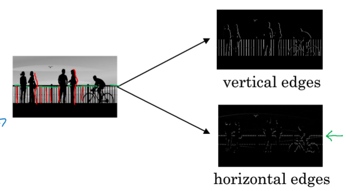

- 垂直检测

6×6 矩阵和 3×3 卷积核进行卷积运算，得到 4*4 矩阵

下图卷积核是垂直检测所用卷积核

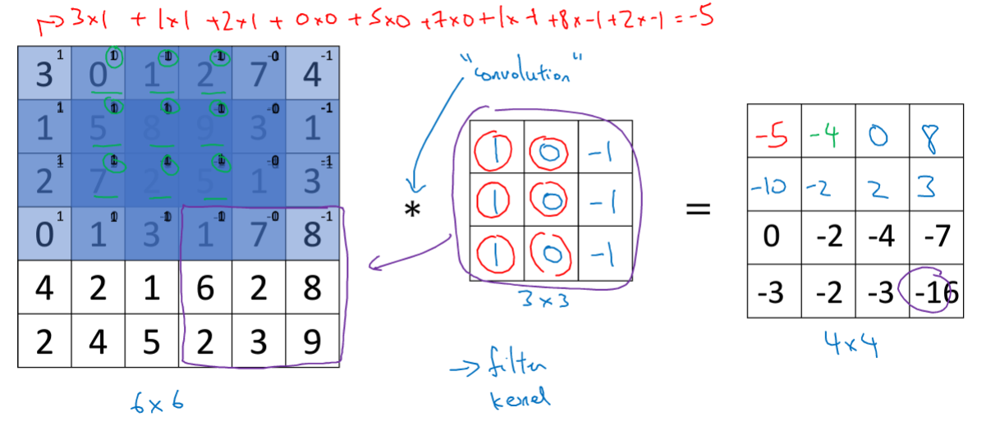

通过该卷积核的卷积运算得到的结果能够成功检测出垂直边缘

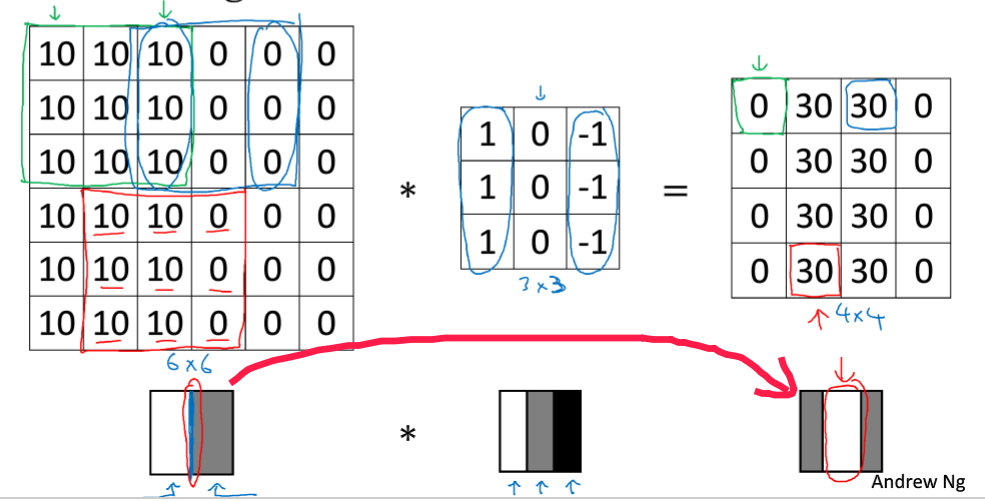

#### 1.3 更多边缘检测内容

左明右暗中间白（正），左暗右明中间黑（负）

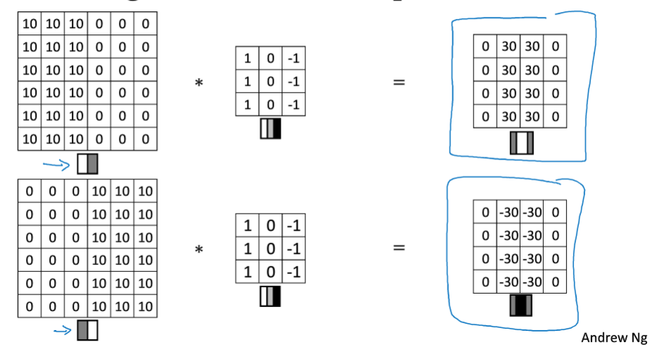

上明下暗中间白（正），上暗下明中间黑（负）

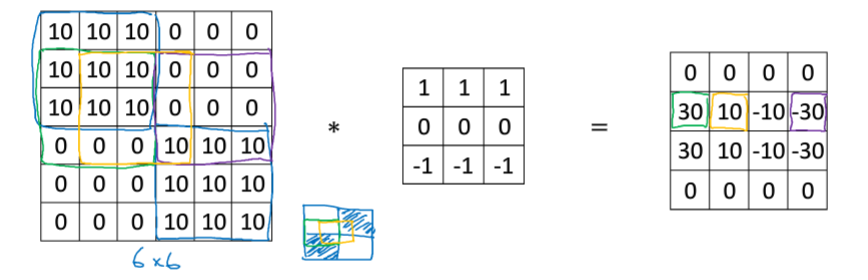

还有一切其他的可以用来进行边缘检测的卷积核，大都是人为设计出来的效果比较好的卷积核

除此之外，还可以让机器自己学习卷积核的参数设置，通过不断训练迭代取得更贴合问题的卷积核参数

#### 1.4 Padding

6×6 的矩阵和 3×3 的卷积核做卷积得到 4×4 的矩阵 `n×n * f×f ——> (n-f+1)×(n-f+1)`

规模变小的缺陷：

1. 多次卷积运算之后图片可能就变成 1×1 缺失很多信息
2. 边缘像素点和中心像素点运算的次数（权重）不同，容易失去边缘信息

如果不希望矩阵的规模发生改变，就需要对原来的矩阵进行 padding

p 是边缘填充像素点的个数，因此卷积之后的矩阵变成 `(n+2p)×(n+2p) * f×f ——> (n+2p-f+1)×(n+2p-f)`

- Padding 方法

1. Valid：不填充 `n×n * f×f ——> (n-f+1)×(n-f+1)`
2. Same：填充运算后得到相同大小矩阵 `(n+2p)×(n+2p) * f×f ——> (n+2p-f+1)×(n+2p-f)`  $p = \frac{f-1}{2}$

因此卷积核 f×f 一般为奇数

#### 1.5 卷积步长

设置步长（stride）之后输出矩阵的形式变为（$\lfloor \frac{n+2p-f}{s}+1\rfloor$） ×（$\lfloor \frac{n+2p-f}{s}+1\rfloor$）

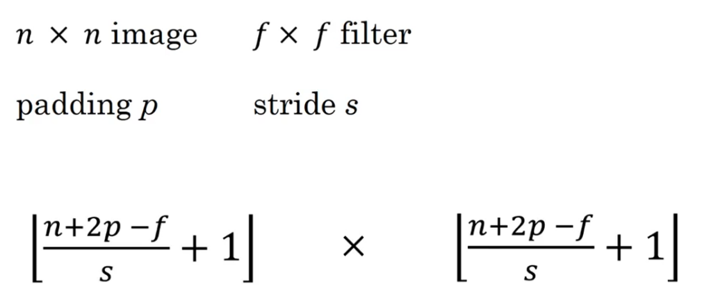

#### 1.6 卷积为何有效

- 灰度图像（二维平面）——>RGB 图像（三维立体）

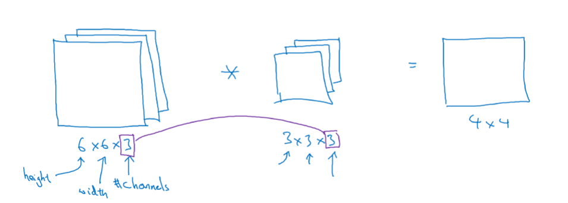

输入图片三个参数分别代表：高度、宽度、通道数

卷积核对应三个参数：高度、宽度、通道数

**注意：**卷积核的通道数**必须等于**原图片的通道数

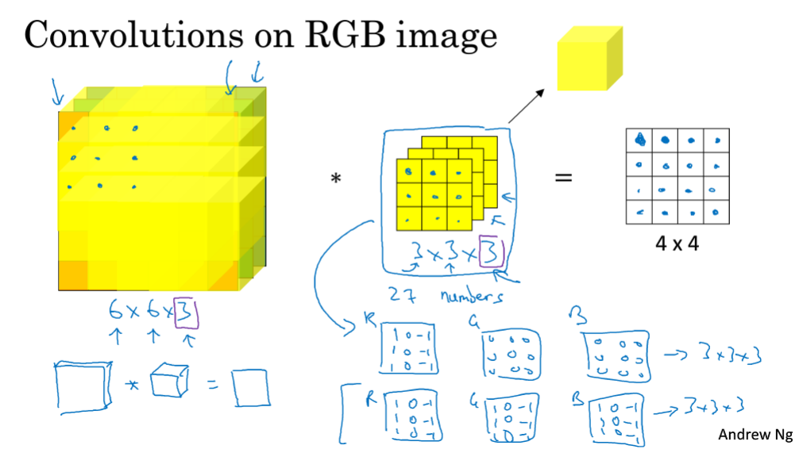

对立方体进行卷积运算：27 个数对应相乘后求和，最终的结果是二维平面图像

只想检测 RGB 其中一个边缘时其他通道卷积核全部置零即可

- 检测多个特征——>多个卷积核

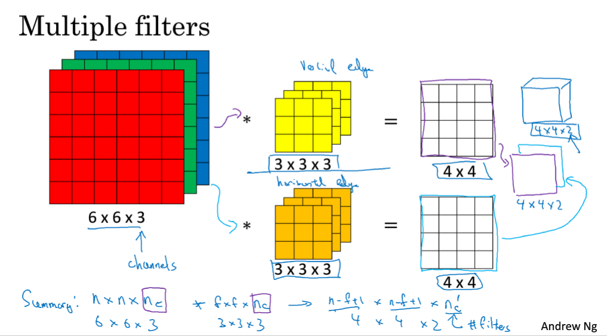

输入图像和两个卷积核卷积结果由平面图（二维）堆叠形成立方体（三维）

扩充通道和添加卷积核后卷积运算的结果公式

（n+2p) × (n+2p) × $n_c$ * f × f × $n_c$ ——>（$\lfloor \frac{n+2p-f}{s}+1\rfloor$） ×（$\lfloor \frac{n+2p-f}{s}+1\rfloor$ × $n_c$）

***卷积核的通道数一定要等于原图片的通道数***

#### 1.7 单层卷积网络

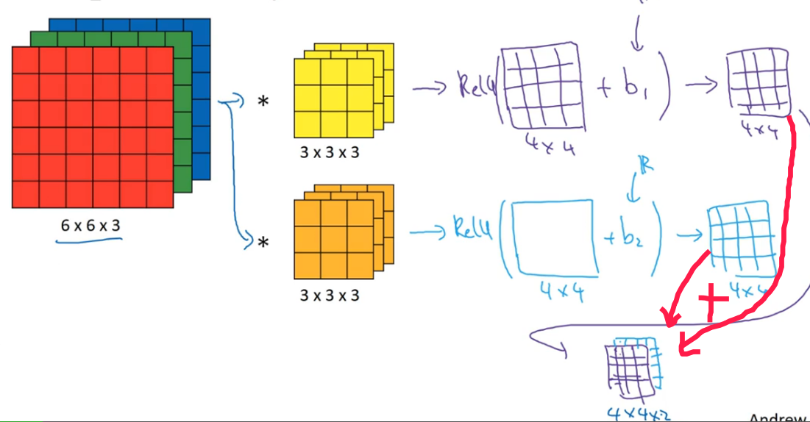

输入图片和卷积核进行卷积运算得到的输出图像——>每个像素点添加偏差（bias）——>非线性激活函数（Relu）——>堆叠形成一层卷积神经网络

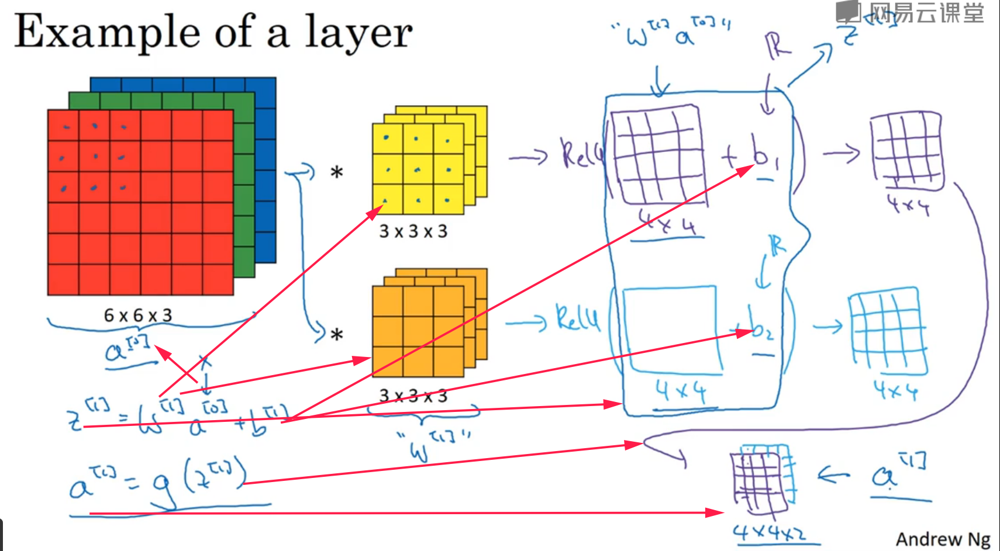

a0 对应输入图像

w1 对应卷积核

b1 对应偏差

z1 对应（多个）卷积运算后的图像

g() 对应激活函数

a1 对应最终输出函数（一层卷积神经网络）

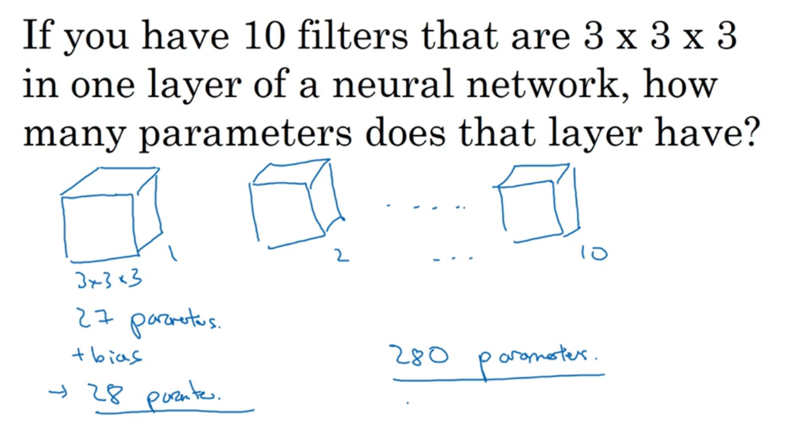

参数的个数 = 卷积核个数 × （卷积核参数乘积 + 偏差）

几个卷积核对应几个特征

参数的数量和输入图像的大小无关，避免因为输入图片过大出现过拟合（over fitting）

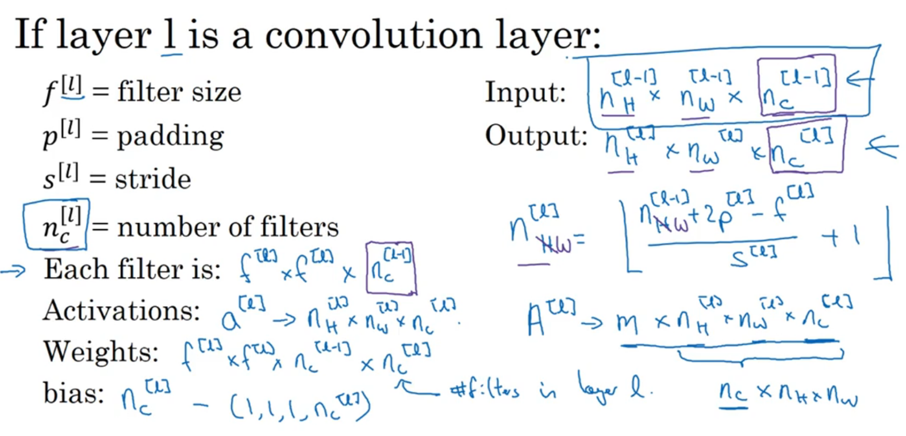

#### 1.8 简单卷积网络示例

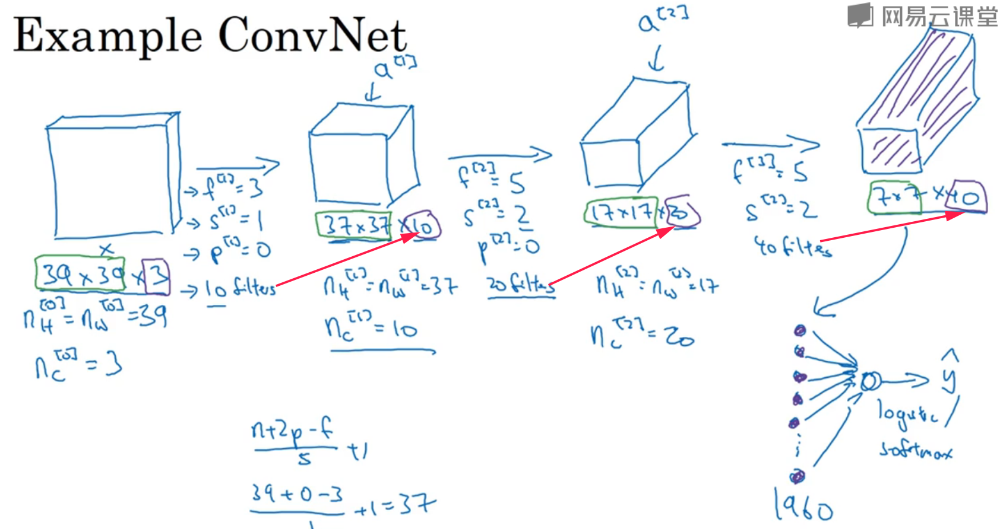

从输入图片到多层卷积输出，高度、宽度减小，通道数增多

最终 1960 个特征变成向量形式经过运算输出一个预测结果

- 神经网络常用的层

1. 卷积层（Convolution-CONV)
2. 池化层（Pooling-POOL）
3. 全连接层（Fully Connected-FC）

#### 1.9 池化层

- 池化的作用

**直观解释**

如果在过滤器中提取到某个特征，那么保留其最大值；如果没有检测到特征，可能所选范围没有这个特征，所以最大值也会很小

**主要原因**

在很多实验中效果很好

- 两种池化方式

1. Max Pooling
2. Average Pooling

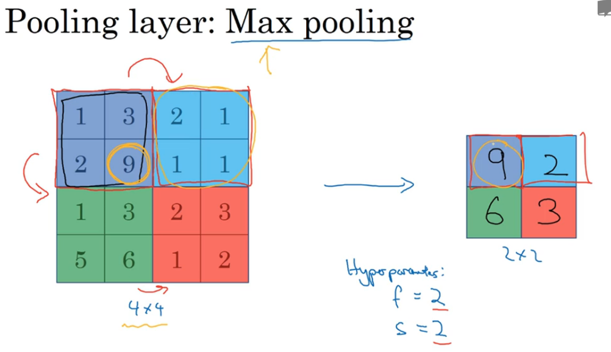

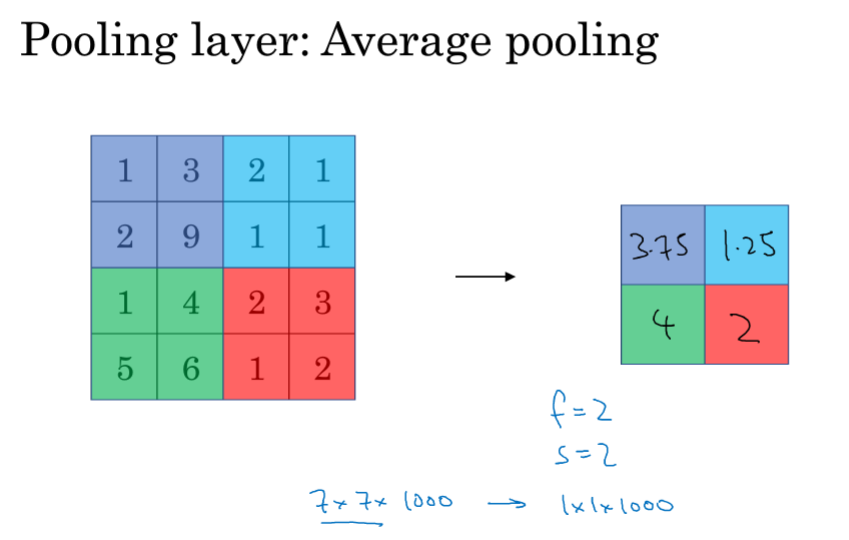

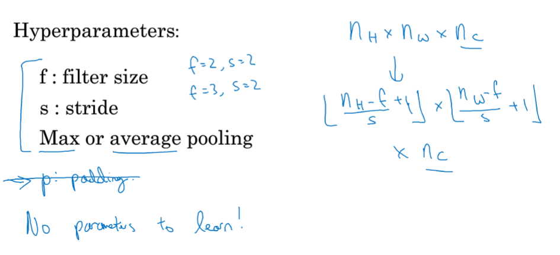

f = 2, s = 2 常用，相当于原来图片高度和宽度缩减一半

池化确定超参数后**不用学习**

#### 1.10 卷积神经网络示例

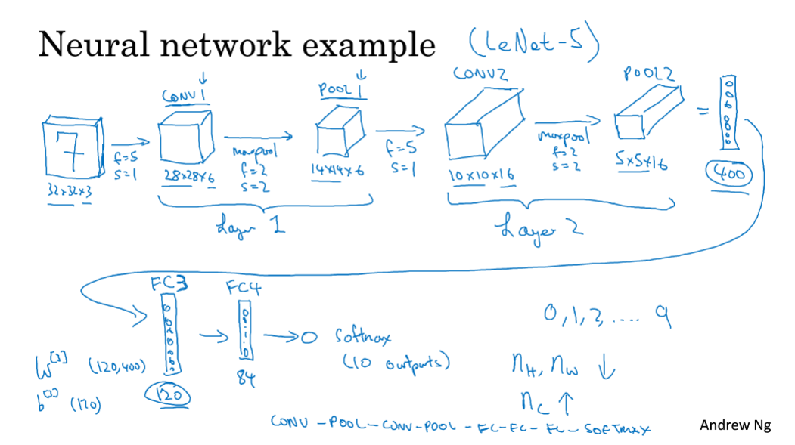

卷积层和池化层算作一层（池化层为超参数无需调整）

全连接层每个输入和每个输出进行计算，即（120,400）

随着网络深入，宽度和高度在减小，通道数在不断增多

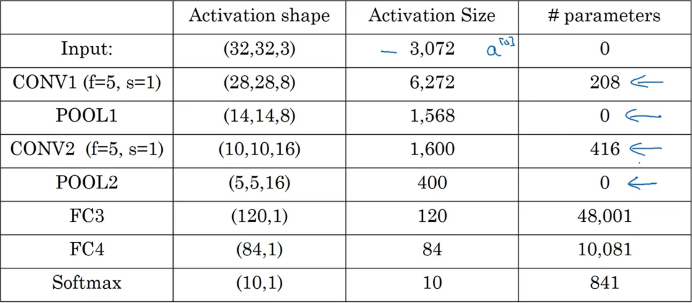

**表格解释**

1. 池化层和最大池化层没有参数
2. 卷积层参数相对较少
3. 许多参数都存在于神经网络的全连接层
4. 随着神经网络加深，激活值逐渐变少（高度 × 宽度 × 通道数）

将基本模块整合起来，构建高效神经网络的关键——**大量阅读具体的别人的案例**

#### 1.11 为什么使用卷积？

传统神经网络参数太多，卷积神经网络能够有效减少参数的数目

- 卷积有效原因

1. 参数共享

无论是对于低阶特征（边缘检测）还是高阶特征（人眼识别），卷积核都能有效地应用于整个输入图片，一个卷积核就能有效提取整张输入图片的某一特征，因此可以减少大量参数的设置

2. 稀疏连接

每个输出的值只依赖于一部分输入，输入的其他部分对输出没有任何影响，不需要每个输入都对一个输出有影响

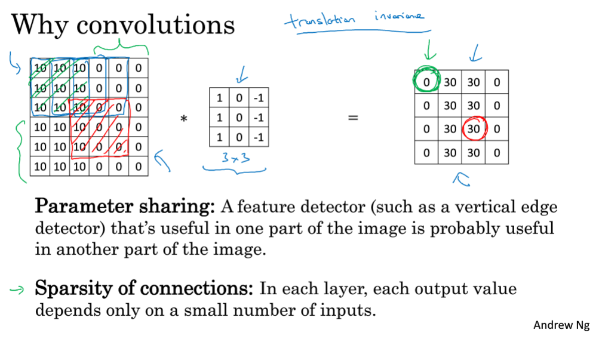

- 实际应用

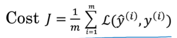

卷积神经网络的目的就是用随机梯度下降法减小损失函数的值使预测值与实际值更贴近

