<!--more-->

### 第二周 深度卷积网络：实例探究

#### 2.1 为什么要进行实例探究？

别人效果很好的模型应用于自己的工作中很有可能也有很好的效果。多阅读优秀论文可以给自己带来思路和指导。

#### 2.2 经典网络

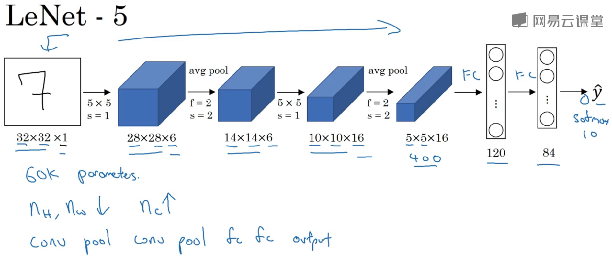

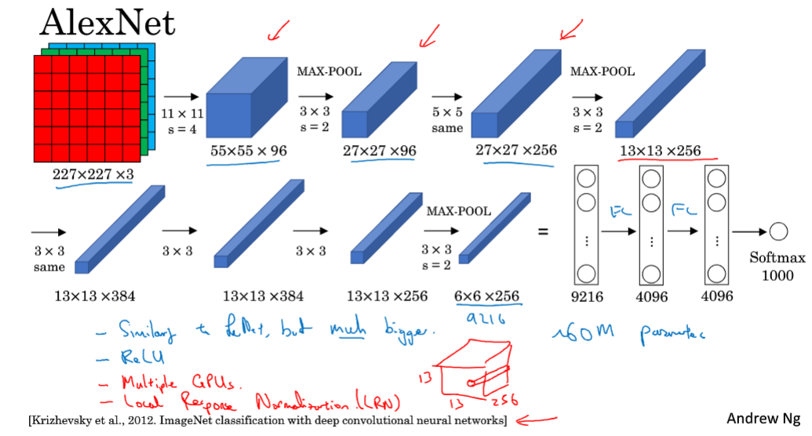

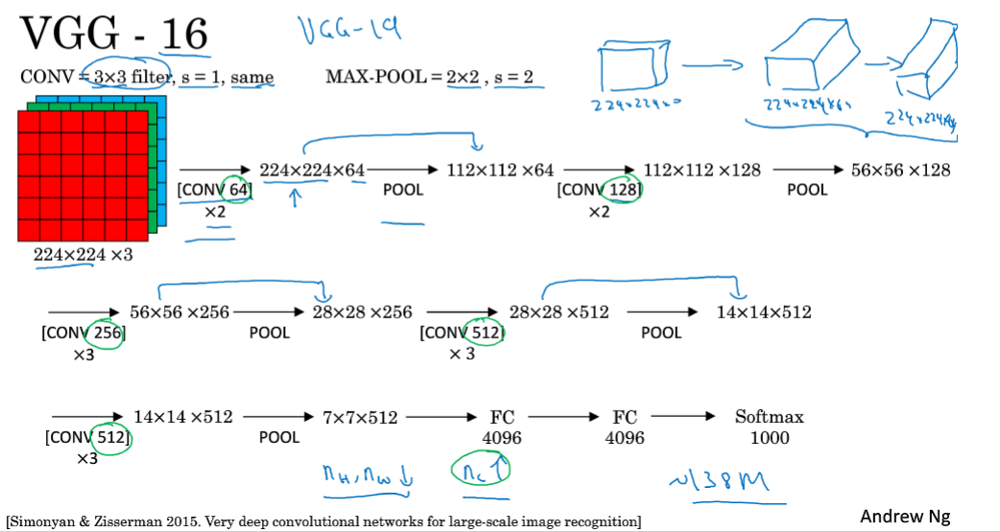

|  模型   |     参数数量     | 卷积层数 |
| :-----: | :--------------: | :------: |
|  LeNet  |       6 万       |    5     |
| AlexNet |      6 千万      |    8     |
|   VGG   | 1 亿 3 千 8 百万 |    16    |

AlexNet 相比 LeNet

1. 参数更多
2. 使用 Relu 函数

VGG 参数更多，图像缩小的比例（除2）和信道增加的比例（乘2）是有规律的、

#### 2.3 残差网络

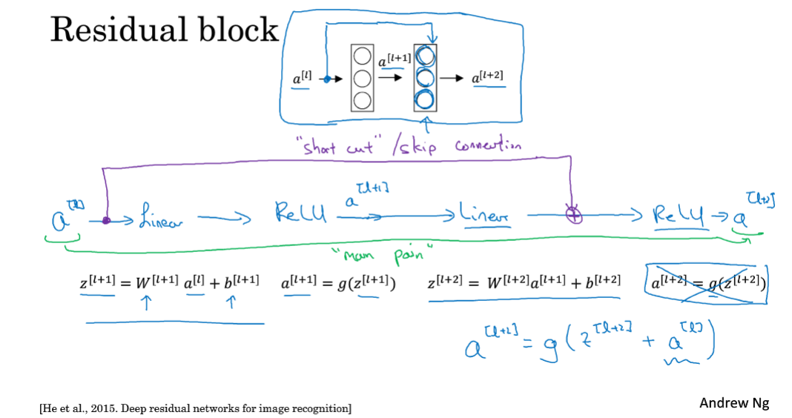

残差块：当前层的输入不仅可以影响下一层的输出，也能影响下一层的下一层

加入残差块后，第三层的图像受第一层和第二层的影响，而不是仅仅受第二层的影响

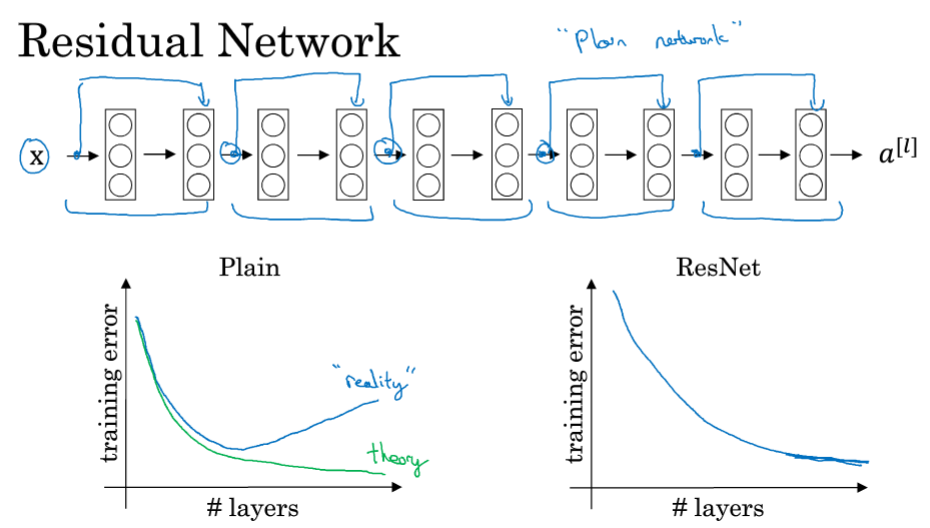

没有添加残差块的网络称为“plain network”

每两层形成一个残差块，一共形成 5 个残差块，这样前面的每个输入都能对最终的输出产生影响

ResNet 在深度网络中非常有效。理论上随着神经网络层数的增加，训练误差应该越来越小，然而实际情况是训练误差先减少后增加，产生梯度消失和梯度爆炸问题。而应用 ResNet 之后可以有效解决上述问题。

#### 2.4 残差网络为什么有效？

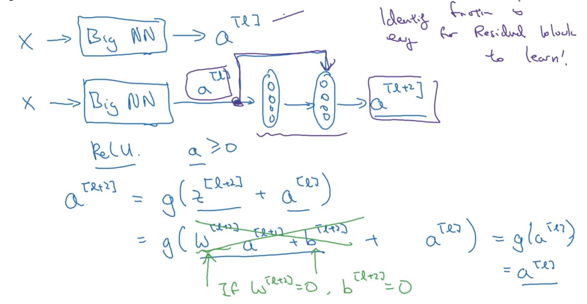

残差网络有效的原因：这些残差块学习恒等函数非常容易，你能确定网络性能不会受到影响，很多时候甚至可以提高效率

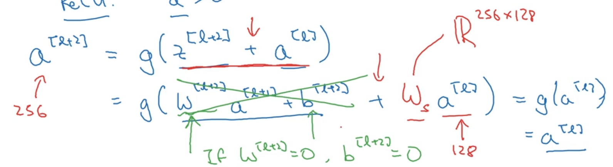

残差块和输入块维度不同时，用一个高维向量 × 残差块

#### 2.5 网络中的网络以及 1 × 1 卷积

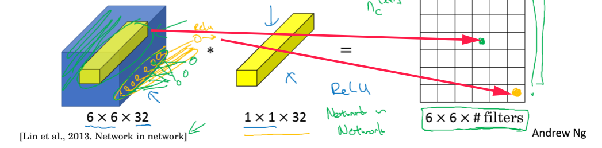

**1 × 1 卷积（Network in Network）的作用**

1. 进行一次卷积运算，可以改变输出图像的高度、宽度、通道数

高度、宽度：$\lfloor \frac{n+2p-f}{s}+1\rfloor$） ×（$\lfloor \frac{n+2p-f}{s}+1\rfloor$

通道数：卷积核的数目

2. 进行非线性（Relu）变换

**池化层和 1 × 1 卷积的区别**

*池化层*：压缩高度和宽度，不改变通道数

*1 × 1 卷积*：本质是卷积核，可以压缩通道数（维度），卷积核的个数就是输出的通道数；还可以改变高度和宽度；进行非线性变换

#### 2.6 谷歌 Inception 网络介绍

**Inception 网络作用**：代替人工来确定卷积层中的过滤器类型或者确定是否需要创建卷积层或池化层

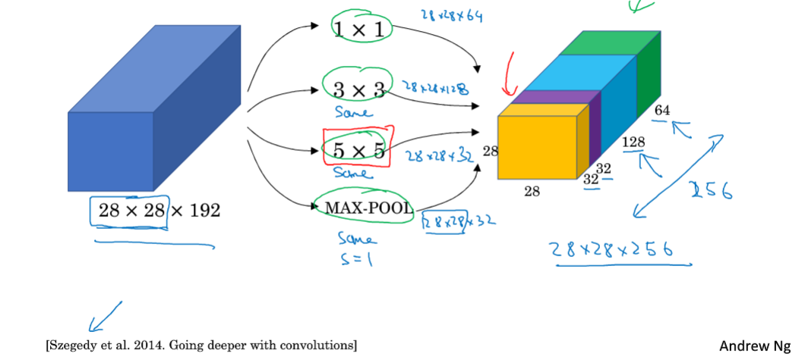

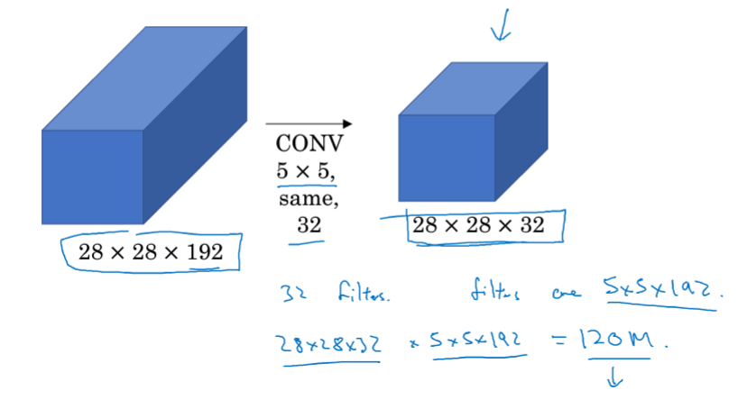

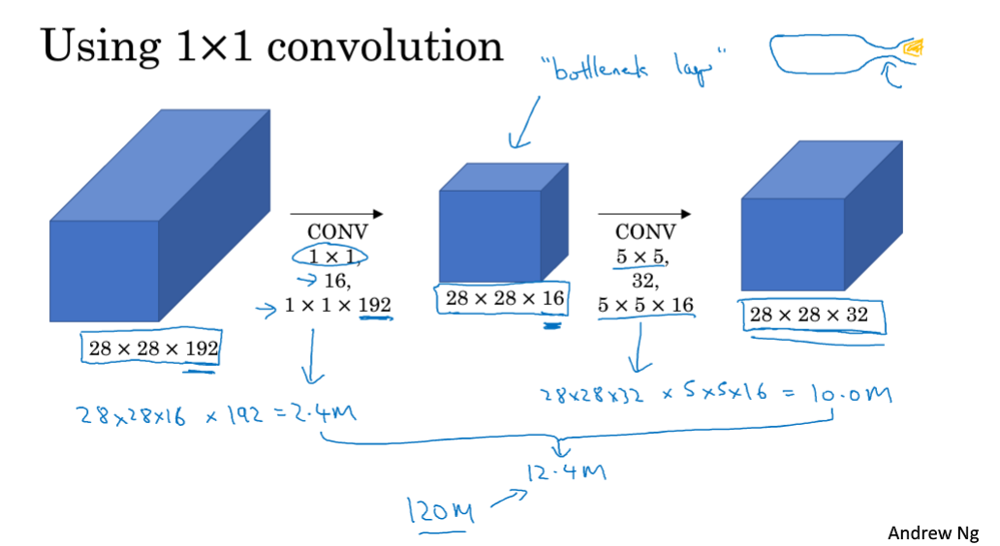

通过使用 1 × 1 卷积作为“瓶颈层”，将计算成本变为原来的十分之一左右，大大降低计算成本

计算成本 = （输出高度 × 输出宽度 × 卷积核数量） × （卷积核高度 × 卷积核宽度 × 输入通道数）

#### 2.7 Inception 网络

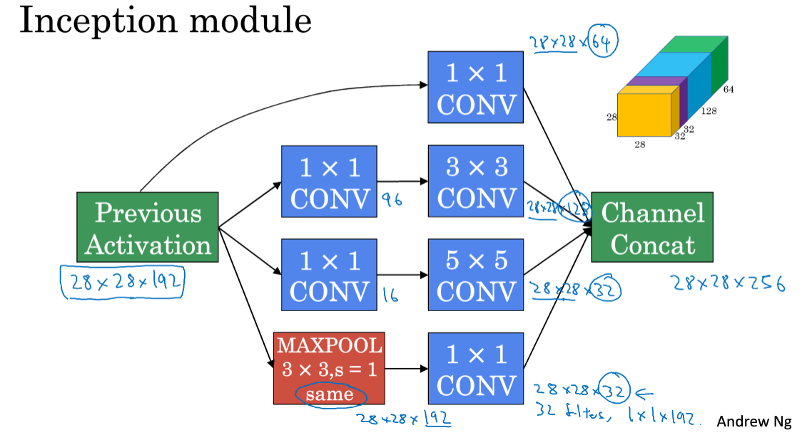

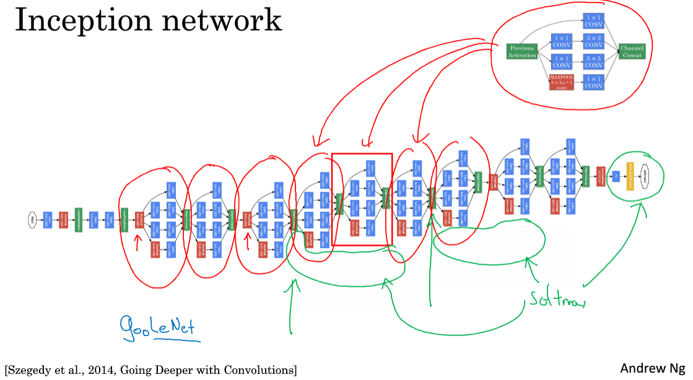

#### 2.8 使用开源的实现方案

搭建模型的步骤：

1. 选择采用的架构
2. 在 Github 上寻找开源实现代码训练

#### 2.9 迁移学习

**迁移学习作用**：别人用大量资源训练数据优化参数得到模型，用迁移学习把公共的数据集的知识迁移到你自己的问题上，可以大幅提升模型的性能和节省自己的时间。

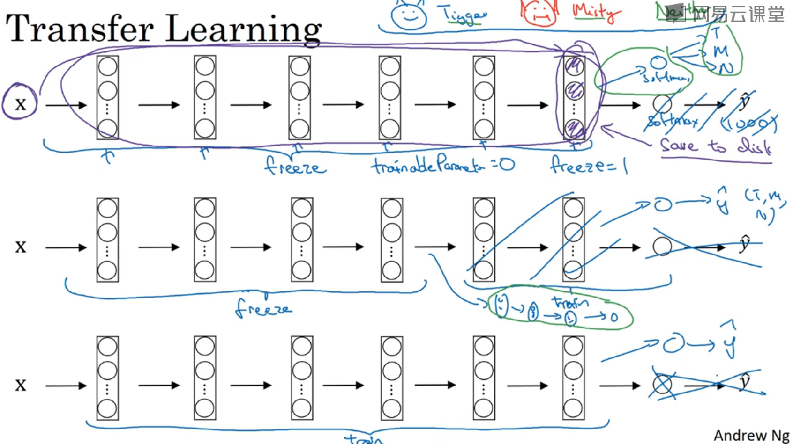

**训练方法**

1. 少量数据集：冻结前面所有层，只修改和 softmax 层有关的参数

技巧：提前计算训练集中所有样本的这一层激活值并存在硬盘中作为输入，这样模型就变得很浅

2. 中等数据集：冻结一部分层训练一部分层
3. 大量数据集：下载模型的权重作为初始化参数代替随机初始化，之后所有层正常训练

> 如果你有越多的数据，你需要冻结的层数越少，你能够训练的层数就越多

#### 2.10 数据扩充

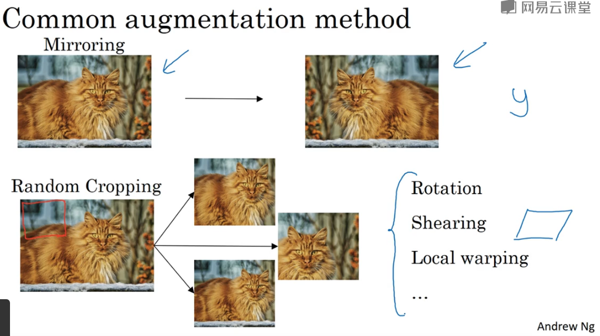

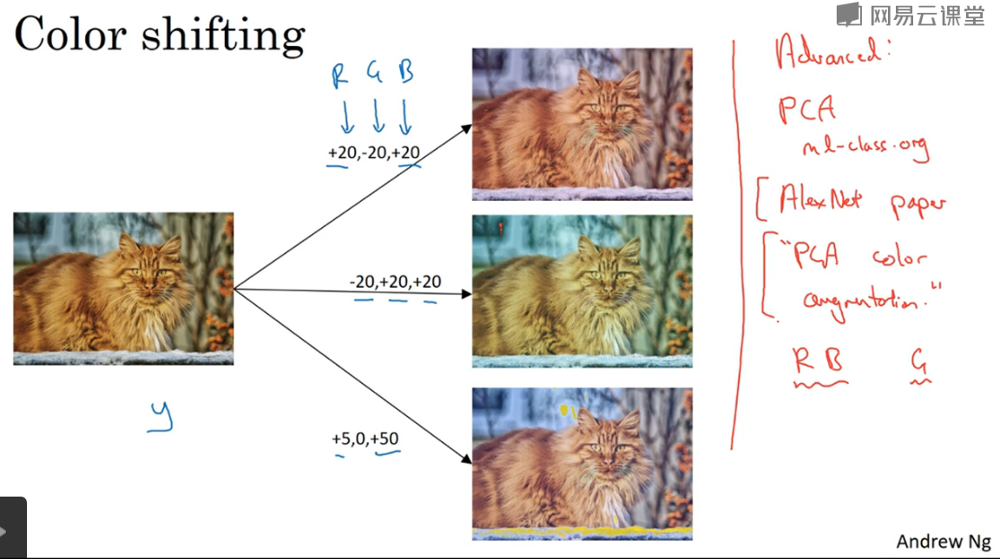

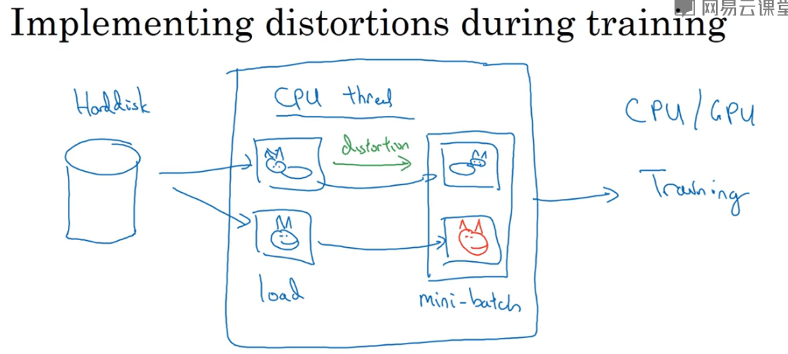

#### 2.11 计算机视觉现状

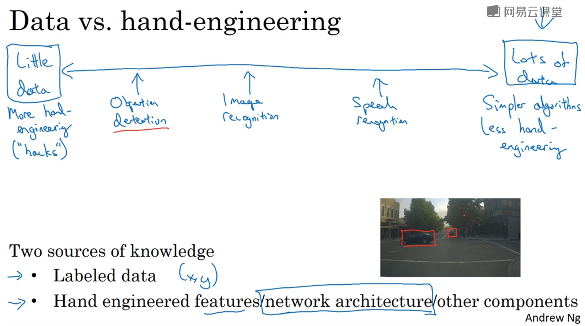

计算机视觉是在学习一个非常复杂的功能，我们经常感到没有足够的数据满足需要。因此计算机视觉更多地依赖于手工工程。

当有大量的数据集时，可以只用简单的算法对模型进行训练，较少地利用手工进行架构设计；在缺乏更多数据的情况下，获得良好表现的方式还是花更多的时间进行架构设计。

数据量少时，可以用迁移学习有效扩充数据量

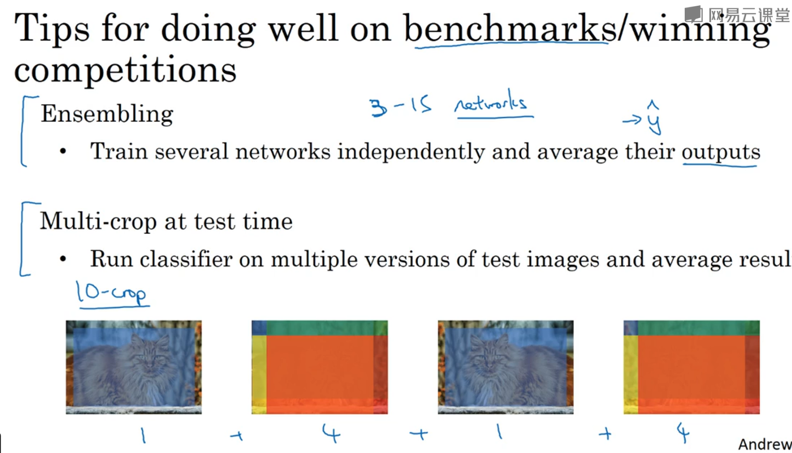

对特定数据集/赢得比赛的技巧，在实际生产中因为计算资源耗费大，计算时间久，没有得到多少应用

核心思想就是多次训练将结果取平均

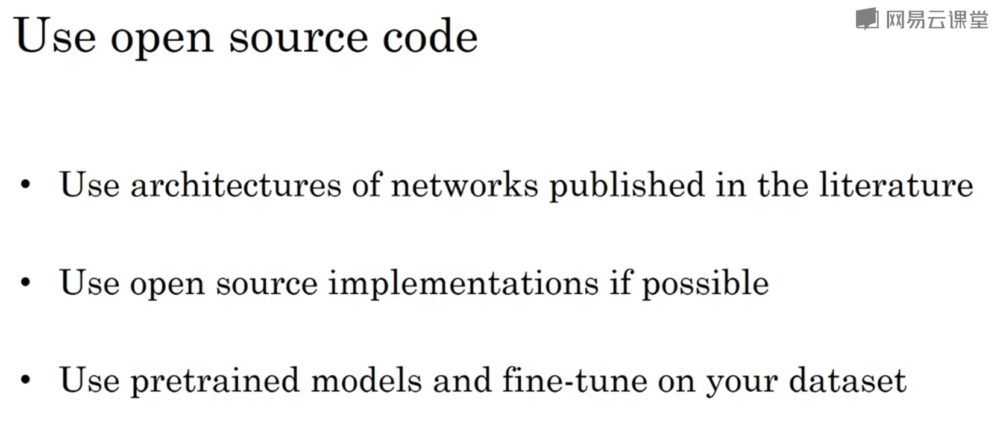

别人精心设计的架构对自己的工程可能会有意想不到的奇效

别人开源的代码实现了繁琐的细节（学习速率衰减计划或超参数）

别人训练好的模型可能用了大量的计算资源和数据，模型效果已经很好

