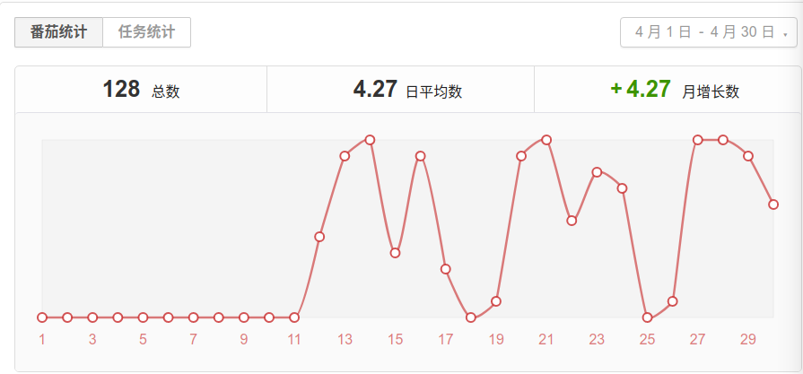
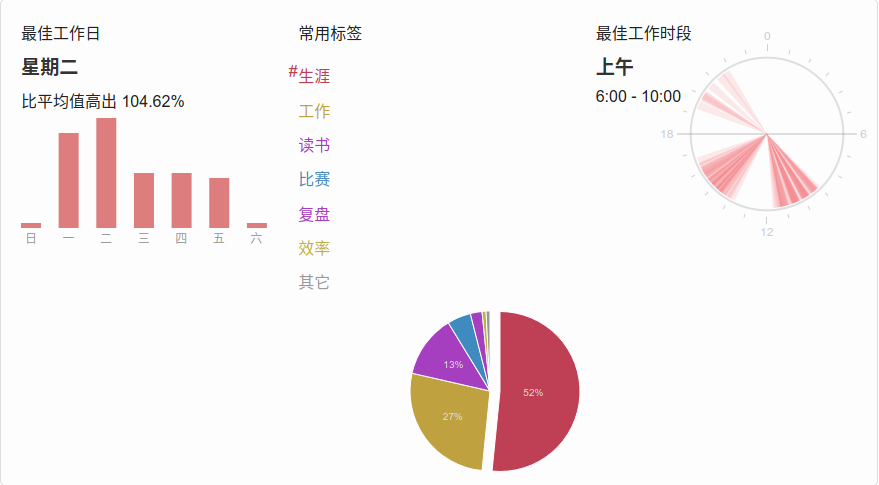
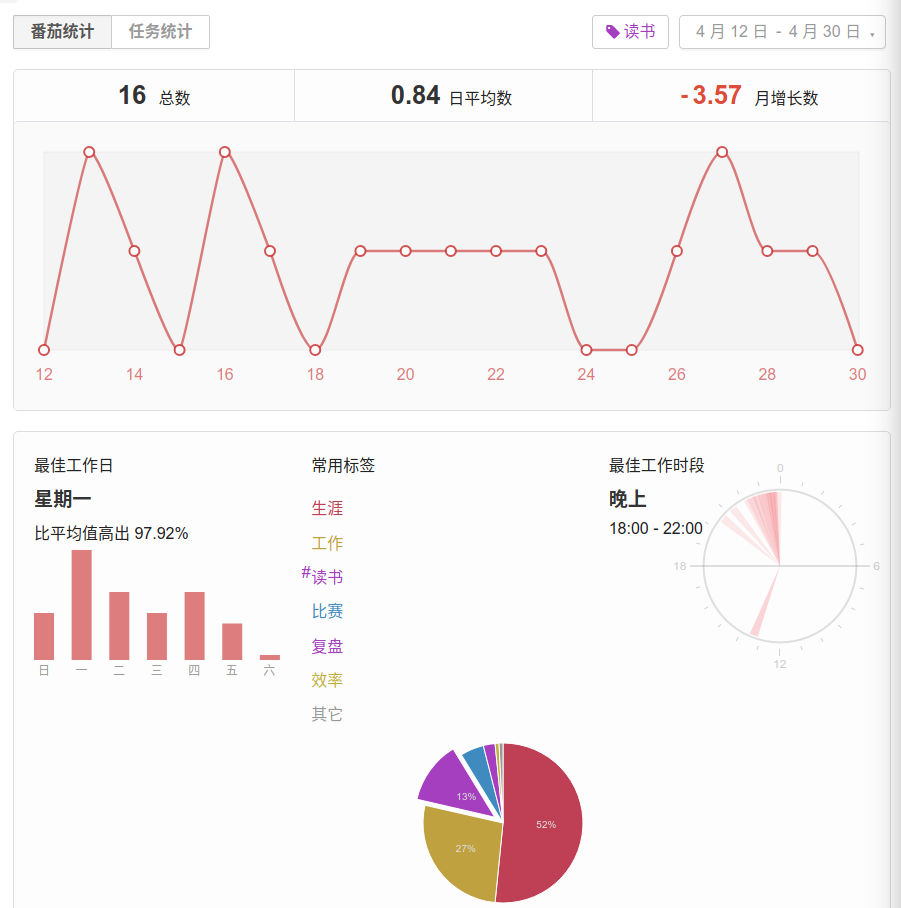

从 4.12 开始重新使用番茄钟，每天平均 6.74 个番茄

生涯 tag 花了 52% 的时间，相信坚持就会有收获，为了长期正确的事情努力，未来也会回馈自己的努力。

开始坚持读书，每天晚上读一个番茄的书，感觉进入佳境，觉得读书确实是令人愉悦地一件事。这个月读完了《王二的经济学故事》，对于经济学有了很多了解，也知道对与问题的思考要更加全面和深入，许多事情并不是想象的那么简单。报名了学院的读书活动，希望可以读完《学会提问》，也可以帮助贫困地区捐出一本书。

