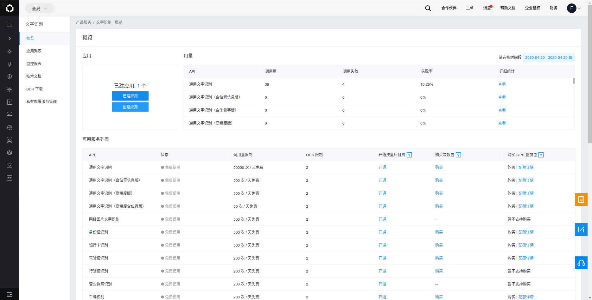
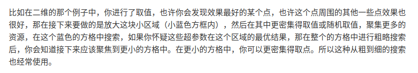
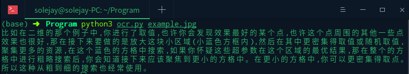

有些 pdf 文档没办法复制句子，有些图片上的字想弄下来却不想手敲，一直打算看看有什么好用的 ocr 软件，Windows 上曾用过天若很好用，但是 linux 上没看到很好的现成软件，在网上搜索之后决定调用百度接口写一个脚本实现文字识别。

### 安装 OCR Python SDK

```python
pip3 install baidu-aip
```

### 注册百度智能云获得 APPID AK SK

注册并登陆进入[百度智能云](https://login.bce.baidu.com/?account=&redirect=http%3A%2F%2Fconsole.bce.baidu.com%2F%3Ffromai%3D1#/aip/overview)，在产品服务中进入文字识别模块



点击创建应用填写内容后可以看到自己申请的 appid ak sk


### 编写脚本调用接口识别

```python
# ocr.py

from aip import AipOcr
import json
import sys


""" 读取图片 """
def get_file_content(filePath):
    with open(filePath, 'rb') as fp:
        return fp.read()


if __name__ == "__main__":

    """ 你的 APPID AK SK """
    APP_ID = '你的 appid'
    API_KEY = '你的 ak'
    SECRET_KEY = '你的 sk'

    client = AipOcr(APP_ID, API_KEY, SECRET_KEY)

    image = get_file_content(sys.argv[1])

    """ 调用通用文字识别, 图片参数为本地图片 """
    client.basicGeneral(image);

    """ 如果有可选参数 """
    options = {}
    options["language_type"] = "CHN_ENG"
    options["detect_direction"] = "false"
    options["detect_language"] = "true"
    options["probability"] = "false"

    """ 带参数调用通用文字识别, 图片参数为本地图片 """
    result = client.basicGeneral(image, options)

    text = ''
    for item in result['words_result']:
        text += item['words']
    print(text)
```

调用命令是 `python3 ocr.py example.jpg `。`ocr.py` 是脚本名称，`example.jpg` 是图片的名字。





### 优化使用

为了方便调用，编辑 `.zshrc`（用系统自带 bash 编辑 `.bshrc`），添加语句

```bash
alias ocr='python3 /home/solejay/Program/ocr.py'
```

这样，把图片保存到桌面，在桌面打开终端只需要输入 `ocr 图片名` 就可以了。

**参考文档**

[百度官方 python 接口文档](https://ai.baidu.com/ai-doc/OCR/Dk3h7yf8m)


