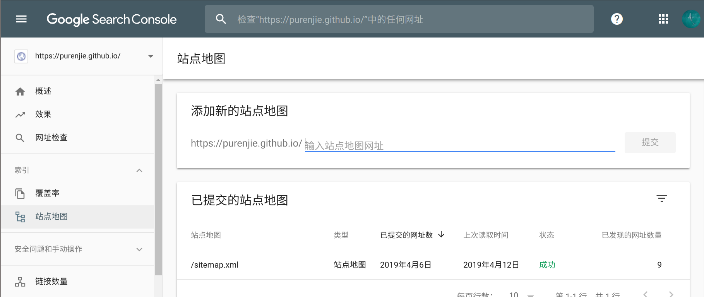
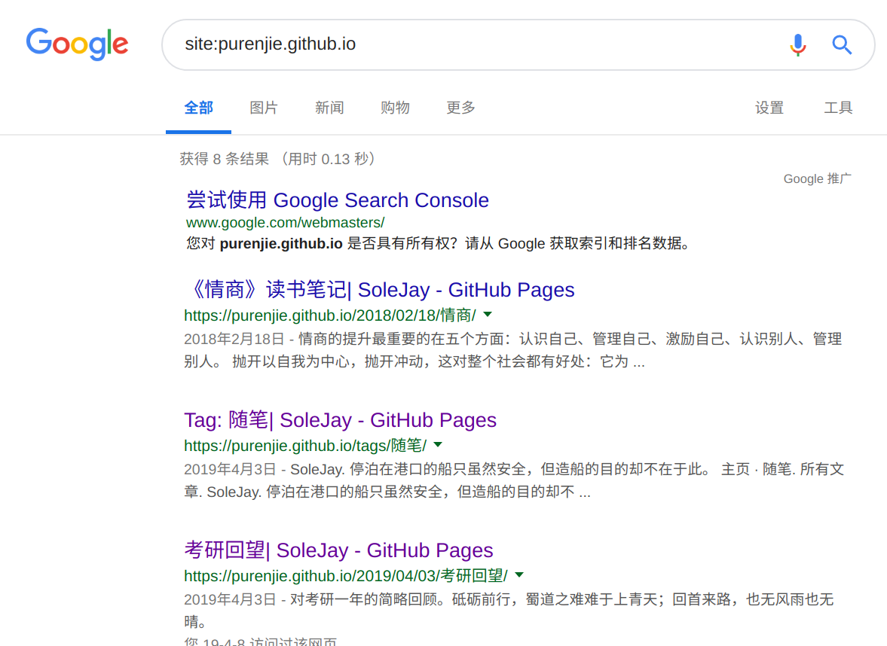

记录一下自己博客被谷歌收录走过的坑，给别人一点小小的借鉴


<!-- more -->

### 谷歌收录 Hexo 博客

自己希望自己写的博客可以被谷歌和百度收录，期间遇到许多问题，查阅许多资料最终实现谷歌收录博客，将完整过程记录下来，以后让自己和别人少走点坑。

其中大部分过程都是参考[这个博客](https://zhuxin.tech/2017/10/20/%E7%BB%99%20Hexo%20%E6%90%AD%E5%BB%BA%E7%9A%84%E5%8D%9A%E5%AE%A2%E5%A2%9E%E5%8A%A0%E7%99%BE%E5%BA%A6%E8%B0%B7%E6%AD%8C%E6%90%9C%E7%B4%A2%E5%BC%95%E6%93%8E%E9%AA%8C%E8%AF%81/) ，在此谢谢博主的指导。

我只写下其中一点没有成功的小细节仅供参考。

- 确认自己的博客是否被收录

实现步骤：

1. 验证站点

这里，以前的文章没有修改 html 文件内容防止格式化，会导致**验证无法通过**

2. 生成站点地图
3. 让谷歌收录博客（也就是收录自己生成的站点地图）

在新版界面中，`站点地图`功能在`索引`栏下。同时，我也遇到了错误问题，博主的方法没有看懂，而且我是用的 GitHub 生成的，因此又开始找别的解决方法。

这里按照[这个博主](https://orchidflower.oschina.io/2017/02/14/submit-to-search-engine/)的方法，成功解决了这个问题，在此谢谢博主的指导。

具体的修改方法如下：

1. 修改 hexo 目录下文件`node_modules/hexo-generator-sitemap/sitemap.xml`：

```
<?xml version="1.0" encoding="UTF-8"?>
<urlset xmlns="http://www.sitemaps.org/schemas/sitemap/0.9">
  
  <url>
    <loc>{{ (config.urlforgoogle+post.path) | uriencode }}</loc>
    
    <lastmod>{{ post.updated.toISOString() }}</lastmod>
    
    <lastmod>{{ post.date.toISOString() }}</lastmod>
    
  </url>
  
</urlset>
```

其实，只是修改了文件的**第五行**，将原来的内容换成了`(config.urlforgoogle+post.path)`

2. 修改 hexo 目录下源配置文件`_config.yml`

```
urlforgoogle: http://你的名字.github.io/

# 自动生成sitemap
sitemap:
  path: sitemap.xml
baidusitemap:
  path: baidusitemap.xml
```

添加了`urlforgoogle: http://你的名字.github.io/`，也就是你自己博客的 url

之后在提交站点地图时，状态变为了成功，也就成功地收录了自己的博客。



我看以前的文章说一两天就可以收录，但是我的情况是并没有那么快，大约一周左右就可以收录了。看到自己的博客被搜索到感觉是美妙的～



##### 参考文章

[给Hexo搭建的博客增加百度谷歌搜索引擎验证](https://zhuxin.tech/2017/10/20/%E7%BB%99%20Hexo%20%E6%90%AD%E5%BB%BA%E7%9A%84%E5%8D%9A%E5%AE%A2%E5%A2%9E%E5%8A%A0%E7%99%BE%E5%BA%A6%E8%B0%B7%E6%AD%8C%E6%90%9C%E7%B4%A2%E5%BC%95%E6%93%8E%E9%AA%8C%E8%AF%81/)

[Hexo博客提交搜索引擎](https://orchidflower.oschina.io/2017/02/14/submit-to-search-engine/)